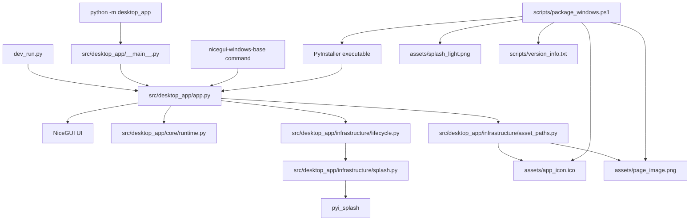

# 📚 Documentation Index

This folder contains the maintenance documentation for the **NiceGui Windows Base** template.

---

## 🧭 Recommended reading order

1. [Development environment](development_environment.md) — complete setup flow for Windows.
2. [Python 3.13 setup on Windows](python_windows_setup.md) — Python installation and validation.
3. [VS Code setup on Windows](vscode_setup.md) — editor, interpreter, and Ruff integration.
4. [PowerShell execution policy](powershell_execution_policy.md) — safe fixes for blocked scripts.
5. [Execution modes](execution_modes.md) — native, web development, module, script, and packaged execution.
6. [Windows packaging](packaging_windows.md) — PyInstaller executable build, version metadata, assets, and splash screen.
7. [Code quality](code_quality.md) — Python linting and formatting with Ruff, plus Markdown validation with markdownlint.
8. [First run checklist](first_run_checklist.md) — practical validation checklist for a fresh clone.
9. [Troubleshooting](troubleshooting.md) — common issues and fixes.
10. [Changelog](../CHANGELOG.md) — release history, version changes, and migration notes.

---

## 🧭 Naming model

The source package is intentionally named `desktop_app`.

This is a stable, generic internal package name for the template. Public names such as the repository name, CLI command, executable name, and visual application title can be changed for each project without renaming the Python package.

Use these names consistently:

- `desktop_app` for Python imports, module execution, package data, and internal source paths;
- `nicegui-windows-base` for the default console script and Windows executable;
- `NiceGui Windows Base` for the default visible application title.

See the root [README](../README.md#-naming-model) for the complete naming model and the list of public metadata that should be changed when the template is reused.

---

## 🏗️ Architecture overview

The project intentionally keeps a small and direct architecture. The application entry point orchestrates startup while runtime detection, asset paths, lifecycle events, and splash handling remain in focused modules.



Key decisions:

- `app.py` owns application startup orchestration, UI composition, logging setup, and the `ui.run(...)` call.
- `core/runtime.py` owns startup source detection, runtime root detection, NiceGUI mode selection, and startup status message formatting.
- `infrastructure/asset_paths.py` owns asset path resolution for normal Python execution and PyInstaller execution.
- `infrastructure/lifecycle.py` owns NiceGUI lifecycle handler registration and lifecycle log messages.
- `infrastructure/splash.py` owns optional PyInstaller splash loading and one-time splash closing.
- `dev_run.py` exists only to request browser reload mode during development.
- `__main__.py` only delegates module execution to the application entry point.
- `package_windows.ps1` uses direct PyInstaller because it supports the project requirements without adding a second packaging path.

---

## 🖨️ Runtime log narrative

The application log is intended to tell the operational story of each run:

```text
Logging initialized for NiceGui Windows Base.
Starting NiceGui Windows Base startup sequence.
Startup source resolved: the packaged executable.
Runtime mode resolved: native mode with reload disabled.
Starting NiceGUI runtime in native mode on port 8000.
NiceGUI runtime started.
Native window opened.
Building the main page for the connected client.
Main page built successfully.
Native window finished loading.
The native window was closed by the user.
Client disconnected from the application.
Application shutdown completed.
```

Detailed runtime evidence, such as `sys._MEIPASS`, asset paths, port selection, splash handling, and repeated resize or move events, is kept at `DEBUG` level.

---

## 📦 Packaging decision

The project uses **PyInstaller directly** instead of `nicegui-pack`.

Reason: the measured size and build time were similar, while direct PyInstaller provides the required options for Windows version metadata, hidden splash imports, windowed execution, and splash screen support.

See [Windows packaging](packaging_windows.md) for the full command and maintenance notes.

---

## 🔗 Back to project README

Return to the root [README](../README.md).
