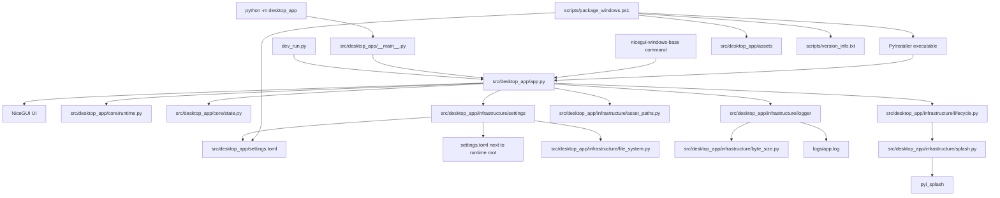

# 📚 Documentation Index

This folder contains the maintenance documentation for the **NiceGui Windows Base** template.

The documentation was updated for the current `0.4.0` project shape, which includes the settings subsystem, shared application state, additional infrastructure helpers, expanded tests, and direct PyInstaller packaging.

---

## 🧭 Recommended reading order

1. [Development environment](development_environment.md) — complete setup flow for Windows.
2. [Python 3.13 setup on Windows](python_windows_setup.md) — Python installation, validation, and virtual environment setup.
3. [VS Code setup on Windows](vscode_setup.md) — editor, interpreter, Ruff, pytest, coverage, and Markdown tooling.
4. [PowerShell execution policy](powershell_execution_policy.md) — safe fixes for blocked PowerShell scripts.
5. [Execution modes](execution_modes.md) — native, web development, module, script, and packaged execution.
6. [Settings subsystem](settings.md) — `settings.toml`, persistence rules, scoped updates, validation, and runtime paths.
7. [Application state](state.md) — shared `AppState`, runtime diagnostics, persisted settings, and UI-facing status.
8. [Logging subsystem](logging.md) — startup buffering, rotating file logs, settings integration, and shutdown cleanup.
9. [Windows packaging](packaging_windows.md) — direct PyInstaller build, assets, settings template, version metadata, and splash screen.
10. [Code quality](code_quality.md) — Ruff, pytest, coverage, compile checks, and Markdown validation.
11. [First run checklist](first_run_checklist.md) — practical validation checklist for a fresh clone or machine.
12. [Troubleshooting](troubleshooting.md) — common issues and fixes.
13. [Changelog](../CHANGELOG.md) — release history, version changes, and migration notes.

---

## 🧭 Naming model

The source package is intentionally named `desktop_app`.

This is a stable, generic internal package name for the template. Public names such as the repository name, CLI command, executable name, and visible application title can be changed for each project without renaming the Python package.

Use these names consistently:

| Context                                                                   | Name                   |
| ------------------------------------------------------------------------- | ---------------------- |
| Python imports, module execution, package data, and internal source paths | `desktop_app`          |
| Default console script and Windows executable                             | `nicegui-windows-base` |
| Default visible application title                                         | `NiceGui Windows Base` |

See the root [README](../README.md#-naming-model) for the complete naming model and the list of public metadata that should be changed when the template is reused.

---

## 🏗️ Architecture overview

The project intentionally keeps a small and direct architecture. The application entry point orchestrates startup while runtime detection, state, settings, logging, asset paths, lifecycle events, and splash handling remain in focused modules.



Key decisions:

- `app.py` owns application startup orchestration, settings loading, logging setup orchestration, UI composition, and the `ui.run(...)` call.
- `core/runtime.py` owns startup source detection, runtime root detection, NiceGUI mode selection, runtime port selection, and startup status message formatting.
- `core/state.py` owns the typed shared `AppState` used by startup, diagnostics, settings, and future UI callbacks.
- `infrastructure/settings/` owns `settings.toml` loading, validation, fallback defaults, scoped persistence, and TOML document updates.
- `infrastructure/logger/` owns logger configuration, startup buffering, rotating file handlers, runtime log path resolution, and shutdown cleanup.
- `infrastructure/asset_paths.py` owns safe asset path resolution for normal Python execution and PyInstaller execution.
- `infrastructure/lifecycle.py` owns NiceGUI lifecycle handler registration and lifecycle log messages.
- `infrastructure/splash.py` owns optional PyInstaller splash loading and one-time splash closing.
- `infrastructure/file_system.py` contains small file-system helpers used by infrastructure modules.
- `infrastructure/byte_size.py` centralizes byte-size parsing used by logger and settings validation.
- `dev_run.py` exists only to request browser reload mode during development.
- `__main__.py` only delegates module execution to the application entry point.
- `package_windows.ps1` uses direct PyInstaller because it supports the project requirements without adding a second packaging path.

---

## 🧠 State and settings boundaries

The project separates in-memory state from persisted settings.

| Area                      | Owner                                                                   | Purpose                                                                                                                      |
| ------------------------- | ----------------------------------------------------------------------- | ---------------------------------------------------------------------------------------------------------------------------- |
| Runtime diagnostics       | [`core/state.py`](../src/desktop_app/core/state.py)                     | Stores startup source, runtime mode, selected port, paths, assets, lifecycle flags, and status messages for the current run. |
| Persisted configuration   | [`infrastructure/settings`](../src/desktop_app/infrastructure/settings) | Loads and saves user-editable `meta`, `window`, `ui`, `log`, and `behavior` values from `settings.toml`.                     |
| Default settings template | [`src/desktop_app/settings.toml`](../src/desktop_app/settings.toml)     | Provides fallback defaults and packaged template data.                                                                       |
| Logging configuration     | [`infrastructure/logger`](../src/desktop_app/infrastructure/logger)     | Uses values from `AppState.log` after settings are loaded.                                                                   |

This boundary keeps UI callbacks and future features from writing directly to infrastructure internals.

---

## 🖨️ Runtime log narrative

The application log is intended to tell the operational story of each run:

```text
Logging initialized for NiceGui Windows Base.
Starting NiceGui Windows Base startup sequence.
Startup source resolved: the packaged executable.
Runtime mode resolved: native mode with reload disabled.
Starting NiceGUI runtime in native mode on port 53124.
NiceGUI runtime started.
Native window opened.
Building the main page for the connected client.
Main page built successfully.
Native window finished loading.
The native window was closed by the user.
Client disconnected from the application.
Application shutdown completed.
```

Detailed runtime evidence, such as `sys._MEIPASS`, asset paths, settings paths, log paths, port selection, splash handling, and repeated resize or move events, is kept at `DEBUG` level. See [Logging subsystem](logging.md) for logger internals.

---

## ⚙️ Settings persistence summary

The application ships with a bundled default settings template:

```text
src\desktop_app\settings.toml
```

At runtime, the persistent settings file is resolved as:

| Runtime                 | Persistent file                             |
| ----------------------- | ------------------------------------------- |
| Normal Python execution | `<current-working-directory>\settings.toml` |
| Environment override    | `%DESKTOP_APP_ROOT%\settings.toml`          |
| PyInstaller executable  | `<executable-directory>\settings.toml`      |

Missing persistent settings are not an error. The application can start from bundled defaults and later save a persistent file when settings are changed.

See [Settings subsystem](settings.md) for the complete behavior.

---

## 📦 Packaging decision

The project uses **PyInstaller directly** instead of `nicegui-pack`.

Reason: the measured size and build time were similar, while direct PyInstaller provides the required options for Windows version metadata, hidden splash imports, windowed execution, bundled settings data, bundled assets, and splash screen support.

See [Windows packaging](packaging_windows.md) for the full command and maintenance notes.

---

## 🔗 Back to project README

Return to the root [README](../README.md).
