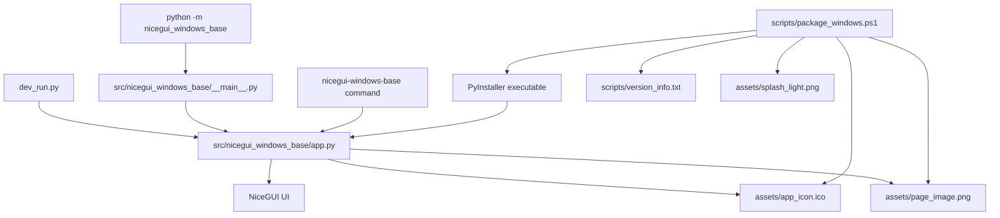

# 📚 Documentation Index

This folder contains the maintenance documentation for the **NiceGui Windows Base** template.

---

## 🧭 Recommended reading order

1. [Development environment](development_environment.md) — complete setup flow for Windows.
2. [Python 3.13 setup on Windows](python_windows_setup.md) — Python installation and validation.
3. [VS Code setup on Windows](vscode_setup.md) — editor, interpreter, and Ruff integration.
4. [PowerShell execution policy](powershell_execution_policy.md) — safe fixes for blocked scripts.
5. [Execution modes](execution_modes.md) — native, web development, module, script, and packaged execution.
6. [Windows packaging](packaging_windows.md) — PyInstaller executable build, version metadata, assets, and splash screen.
7. [Code quality with Ruff](code_quality.md) — linting, formatting, and pre-commit validation.
8. [First run checklist](first_run_checklist.md) — practical validation checklist for a fresh clone.
9. [Troubleshooting](troubleshooting.md) — common issues and fixes.

---

## 🏗️ Architecture overview

The project intentionally keeps a small and direct architecture:

Key decisions:

- `app.py` owns UI composition, startup diagnostics, asset resolution, and NiceGUI startup.
- `dev_run.py` exists only to request browser reload mode during development.
- `__main__.py` only delegates module execution to the application entry point.
- `package_windows.ps1` uses direct PyInstaller because it supports the project requirements without adding a second packaging path.

---

## 📦 Packaging decision

The project uses **PyInstaller directly** instead of `nicegui-pack`.

Reason: the measured size and build time were similar, while direct PyInstaller provides the required options for Windows version metadata and splash screen support.

See [Windows packaging](packaging_windows.md) for the full command and maintenance notes.

---

## 🔗 Back to project README

Return to the root [README](../README.md).
