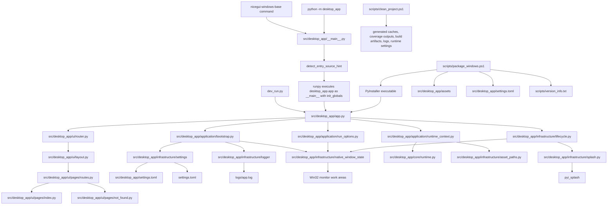
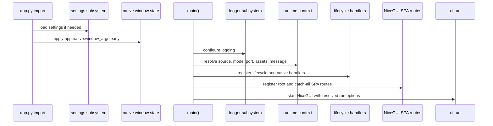
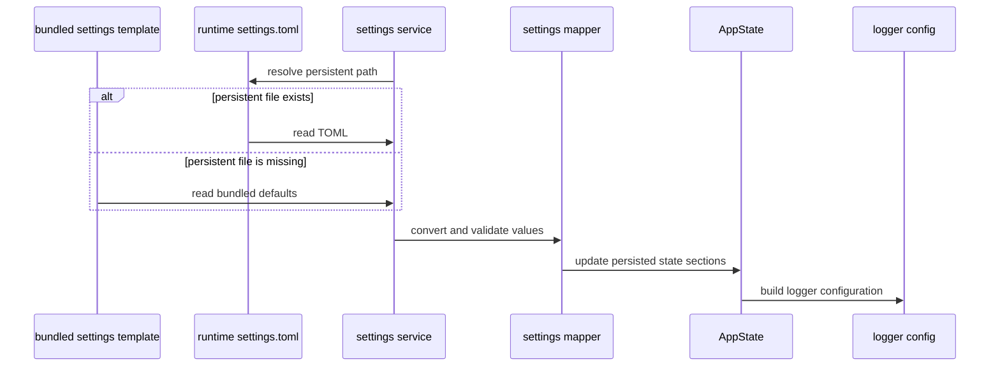
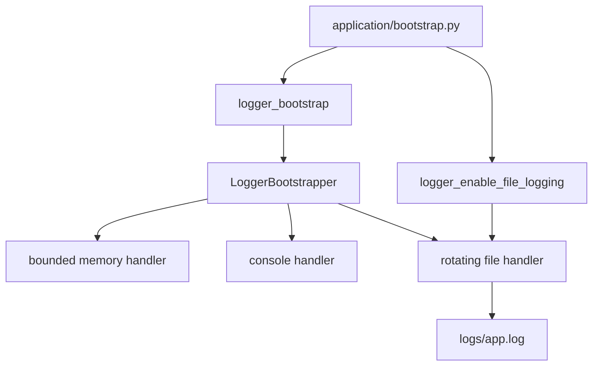

# 🏗️ Architecture Overview

This guide explains the current architecture of **NiceGui Windows Base**.

Use it when you need to understand startup flow, module responsibilities, NiceGUI SPA routing, settings persistence, logging, native window state, packaging inputs, generated-file cleanup, or safe extension points for future features.

---

## 🎯 Architecture goals

The project intentionally uses a small and direct architecture.

Main goals:

- keep `src/desktop_app/app.py` focused on application startup orchestration;
- keep NiceGUI page composition inside `src/desktop_app/ui`;
- keep reusable runtime state in plain dataclasses under `src/desktop_app/core`;
- keep file-system, settings, logging, assets, native window, lifecycle, and splash behavior in `src/desktop_app/infrastructure`;
- keep blocking or environment-specific work outside NiceGUI page builders;
- keep the template easy to rename at the public metadata level without renaming the internal Python package.

The current code does not include SAP GUI, RPA, or SharePoint integrations. Future integrations should be added as separate services instead of being placed directly in UI callbacks.

---

## 🧭 High-level module map



---

## 🚀 Startup flow

The startup sequence is split into focused steps so the entry point stays small.



Key points:

- `prepare_native_window_arguments_before_main()` runs at module import time so persisted native window position is available before `ui.run(...)` creates the native window.
- `main(development_mode=False)` is the normal startup path after entry-point routing.
- The CLI command and `python -m desktop_app` call `desktop_app.__main__:run`, which captures the original entry source before `runpy` changes `sys.argv`.
- `__main__.py` passes that preserved source to `desktop_app.app` through `runpy.run_module(..., init_globals=...)`, so runtime diagnostics can still distinguish pyproject command execution from module execution.
- `desktop_app.app` still runs with `__main__` semantics so native window arguments are applied through the same Windows-safe path as direct `app.py` execution.
- `dev_run.py` calls `main(development_mode=True)` to run in browser development mode with reload enabled.
- Runtime values are mirrored into `AppState` for diagnostics and future UI use.

---

## 📦 Application package responsibilities

| Module                                              | Responsibility                                                                                                   |
| --------------------------------------------------- | ---------------------------------------------------------------------------------------------------------------- |
| `src/desktop_app/app.py`                            | Coordinates startup, lifecycle registration, SPA route registration, and `ui.run(...)`.                          |
| `src/desktop_app/__main__.py`                       | Captures the original command or module startup source and routes execution through `runpy.run_module(...)`.     |
| `src/desktop_app/application/bootstrap.py`          | Loads settings, resolves runtime paths, applies early native window arguments, and configures logging.           |
| `src/desktop_app/application/runtime_context.py`    | Resolves startup source hints, mode, port, startup message, icon path, and splash path.                          |
| `src/desktop_app/application/run_options.py`        | Builds the final dictionary passed to `ui.run(...)`.                                                             |
| `src/desktop_app/constants.py`                      | Stores shared application constants, asset names, compatibility aliases for logger defaults, and version values. |
| `src/desktop_app/infrastructure/logger/defaults.py` | Stores defaults owned by the logger package so the logger does not depend on application constants.              |

`application/run_options.py` intentionally does not pass window geometry through `ui.run(...)`. Native geometry is centralized in `app.native.window_args` through `infrastructure/native_window_state/` to avoid conflicting startup sources.

`core/runtime.py` owns the `StartupSource` enum, `ENTRY_SOURCE_HINT_GLOBAL`, wrapper-source detection, hint normalization, frozen-executable detection, and fallback `sys.argv` inspection. The current detection priority is development mode, packaged executable, preserved wrapper hint, then direct argv fallback.

### 🧰 Project script responsibilities

| Script                        | Responsibility                                                                                                                 |
| ----------------------------- | ------------------------------------------------------------------------------------------------------------------------------ |
| `scripts/clean_project.ps1`   | Removes generated caches, coverage outputs, egg-info metadata, build artifacts, logs, and root runtime settings by default.       |
| `scripts/package_windows.ps1` | Builds the Windows executable with direct PyInstaller, bundled assets, bundled settings, version metadata, and splash support. |
| `scripts/version_info.txt`    | Provides Windows executable version metadata consumed by PyInstaller.                                                          |

The cleanup script is part of the maintenance architecture, not the application runtime. It should be documented with the project scripts because it affects source archives, clean validations, and packaging output cleanup without changing application behavior.

---

## 🖥️ NiceGUI SPA structure

The UI uses a single-page application shell with `ui.sub_pages`.

```mermaid
flowchart TD
    A[src/desktop_app/ui/router.py] --> B[@ui.page('/')]
    A --> C[@ui.page('/{_:path}')]
    B --> D[src/desktop_app/ui/layout.py]
    C --> D
    D --> E[ui.sub_pages]
    E --> F[src/desktop_app/ui/pages/routes.py]
    F --> G['/' route to index page]
    F --> H['/{_:path}' route to fallback page]
```

Current UI responsibilities:

| Module                                  | Responsibility                                             |
| --------------------------------------- | ---------------------------------------------------------- |
| `src/desktop_app/ui/router.py`          | Registers root and catch-all NiceGUI routes.               |
| `src/desktop_app/ui/layout.py`          | Builds the shared SPA shell and mounts `ui.sub_pages`.     |
| `src/desktop_app/ui/pages/routes.py`    | Centralizes sub-page route mappings.                       |
| `src/desktop_app/ui/pages/index.py`     | Builds the default index page and resolves the page image. |
| `src/desktop_app/ui/pages/not_found.py` | Builds the fallback page for unknown in-app routes.        |

When adding a new page, prefer this path:

1. create a page module under `src/desktop_app/ui/pages/`;
2. add the route to `src/desktop_app/ui/pages/routes.py`;
3. keep callbacks small;
4. delegate business logic to non-UI services.

---

## 🧠 State and settings boundaries

The project separates runtime state from persisted configuration.

| Area                      | Owner                                     | Purpose                                                                                                                |
| ------------------------- | ----------------------------------------- | ---------------------------------------------------------------------------------------------------------------------- |
| Runtime diagnostics       | `src/desktop_app/core/state.py`           | Stores current process values such as startup source, mode, port, paths, assets, lifecycle flags, and status messages. |
| Persisted settings        | `src/desktop_app/infrastructure/settings` | Loads and saves user-editable `meta`, `window`, `ui`, `log`, and `behavior` values.                                    |
| Default settings template | `src/desktop_app/settings.toml`           | Provides bundled defaults and packaged template data.                                                                  |
| Runtime settings file     | `settings.toml`                           | Stores editable settings in the runtime root.                                                                          |

`AppState` is a plain Python dataclass model. It does not read or write files by itself. File persistence belongs to the settings subsystem.

See also:

- [Settings subsystem](settings.md)
- [Application state](state.md)

---

## 💾 Settings persistence flow



Confirmed persisted groups are:

- `meta`;
- `window`;
- `ui`;
- `log`;
- `behavior`.

The application can load from bundled defaults without creating a persistent file. A persistent `settings.toml` is created only when a save operation runs.

---

## 🪟 Native window persistence

Native window geometry is handled by `src/desktop_app/infrastructure/native_window_state/`.

Responsibilities:

- load persisted `window` settings before the native window is created;
- normalize persisted coordinates against current Windows monitor work areas;
- apply startup geometry through `app.native.window_args`;
- update `AppState.window` from move and resize events;
- refresh geometry from the NiceGUI native window proxy when available;
- save the `window` settings group on close or shutdown when persistence is enabled.

The monitor guard preserves saved width and height. It adjusts only `x` and `y` when persisted coordinates would make the window difficult to recover after monitor removal, monitor reordering, or resolution changes.

See [Native window state package guide](../src/desktop_app/infrastructure/native_window_state/README.md) for the detailed behavior.

---

## 🖨️ Logging architecture

The logging subsystem lives in `src/desktop_app/infrastructure/logger`.



Important behavior:

- early log records can be buffered before the final log file path is known;
- logger configuration is built from `AppState.log` after settings load;
- packaged execution disables console logging because the executable is windowed;
- rotating file logging writes to `logs/app.log` relative to the runtime root;
- shutdown releases file handlers to reduce locked-file issues on Windows.

See [Logger package guide](../src/desktop_app/infrastructure/logger/README.md) for the full logger design.

---

## 🖼️ Asset handling

Runtime assets are stored under:

```text
src\desktop_app\assets
```

Current packaged asset inputs are defined in `scripts/package_windows.ps1` and package data is declared in `pyproject.toml`.

Confirmed runtime assets include:

- `app_icon.ico`;
- `logo.png`;
- `page_image.png`;
- `splash.svg`;
- `splash_dark.png`;
- `splash_light.png`.

`src/desktop_app/infrastructure/asset_paths.py` resolves assets for normal Python execution and packaged execution. It rejects unsafe asset names such as absolute paths, drive-based paths, rooted paths, or parent-directory traversal.

---

## 📦 Packaging architecture

Packaging uses direct PyInstaller through:

```powershell
.\scripts\package_windows.ps1
```

The packaging script uses:

- `src\desktop_app\app.py` as the PyInstaller entry point;
- `src\desktop_app\assets` as bundled asset data;
- `src\desktop_app\settings.toml` as bundled package data through `pyproject.toml`;
- `src\desktop_app\assets\app_icon.ico` as the executable icon;
- `src\desktop_app\assets\splash_light.png` as the PyInstaller splash screen;
- `scripts\version_info.txt` as Windows version metadata.

The script creates the packaged executable and a packaging report under `dist` when packaging succeeds.

Generated packaging outputs can be removed with:

```powershell
.\scripts\clean_project.ps1
```

Build artifact cleanup is enabled by default in that script. Use `-IncludeBuildArtifacts:$false` only when existing `build`, `dist`, or `*.spec` files must be preserved.

See [Windows packaging](packaging_windows.md) for the full command and maintenance rules. For generated-file cleanup, see [Code quality](code_quality.md#-workspace-cleanup).

---

## 🧪 Test and quality boundaries

Tests follow the source package structure:

```text
tests\application
tests\core
tests\infrastructure
tests\ui
```

The quality workflow is documented in [Code quality](code_quality.md). The main validation command documented by the project is:

```powershell
pytest tests --cov=desktop_app --cov-report=term-missing --cov-fail-under=100
```

Do not document a coverage result as passed unless the command was actually executed in the target environment.

---

## 🧩 Extension guidelines

When extending the template:

- add UI pages under `src/desktop_app/ui/pages` and register them in `routes.py`;
- keep UI callbacks small and delegate logic to services;
- keep blocking work away from the NiceGUI main thread;
- put environment-specific integrations under infrastructure or a focused service package;
- update settings mapping only when a value must be persisted;
- update `docs/README.md` only with navigation links and keep deeper explanations in focused documents.

For future external integrations, isolate blocking or environment-specific automation away from the NiceGUI main thread and expose only small service functions to UI callbacks.

---

## 🔗 Related documents

- [Documentation index](README.md)
- [Execution modes](execution_modes.md)
- [Settings subsystem](settings.md)
- [Application state](state.md)
- [Native window state package guide](../src/desktop_app/infrastructure/native_window_state/README.md)
- [Logger package guide](../src/desktop_app/infrastructure/logger/README.md)
- [Windows packaging](packaging_windows.md)
- [Code quality](code_quality.md)
