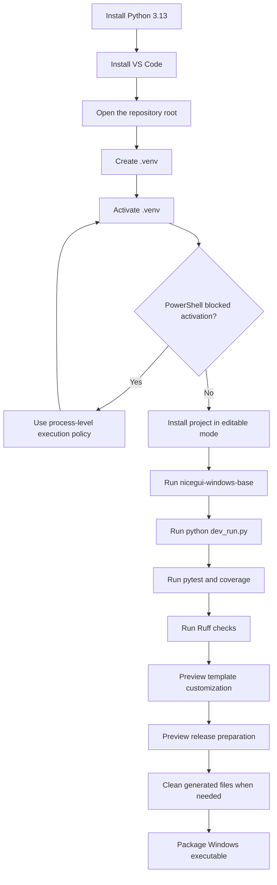

# 🧰 Development Environment

This guide explains the complete setup path for the current **NiceGui Windows Base** project on Windows.

Use it as the main setup guide. More detailed explanations are linked from each section.

---

## 📌 When should you use this guide?

Use this guide when:

- preparing a new Windows machine;
- cloning or opening the repository for the first time;
- creating or recreating the `.venv`;
- installing the project from `pyproject.toml`;
- validating native execution, browser development mode, settings persistence, template customization, release automation, tests, Ruff, and packaging.

---

## 🧭 Setup flow



---

## 🐍 1. Install Python 3.13

The project targets Python 3.13.x.

Follow the detailed guide:

- [Python 3.13 setup on Windows](python_windows_setup.md)

Quick validation:

```powershell
py -3.13 --version
```

Expected result:

```text
Python 3.13.x
```

---

## 🧰 2. Install VS Code

VS Code is the recommended editor for this project.

Follow the detailed guide:

- [VS Code setup](vscode_setup.md)

---

## 📂 3. Open the repository root

Open the folder that contains:

```text
pyproject.toml
```

Do not open only `src`, `docs`, `scripts`, or `tests`. Opening the root keeps `.venv`, `.vscode`, docs, tests, scripts, package metadata, and relative documentation links aligned.

---

## ⚙️ 4. Create the virtual environment

From the repository root:

```powershell
py -3.13 -m venv .venv
```

Do not commit `.venv` to Git.

---

## ▶️ 5. Activate the virtual environment

```powershell
.\.venv\Scripts\Activate.ps1
```

Confirm the environment:

```powershell
python --version
python -c "import sys; print(sys.executable)"
```

Expected path shape:

```text
<repository-root>\.venv\Scripts\python.exe
```

If PowerShell blocks activation, see:

- [PowerShell execution policy](powershell_execution_policy.md)

---

## 📦 6. Install the project

With `.venv` active:

```powershell
python -m pip install --upgrade pip
python -m pip install -e ".[dev,packaging]"
```

This installs:

- the project in editable mode;
- the internal `desktop_app` package from the `src` layout;
- runtime dependencies from `pyproject.toml`;
- Ruff, pytest, pytest-cov, and coverage through the `dev` extra;
- PyInstaller through the `packaging` extra.

The editable install exposes the internal `desktop_app` package. The public command name is configured separately in `pyproject.toml`. This separation is intentional for template reuse; see the root [README](../README.md#-naming-model).

---

## ▶️ 7. Run the application

Normal native mode:

```powershell
nicegui-windows-base
```

Alternative module execution:

```powershell
python -m desktop_app
```

Browser-based development mode:

```powershell
python dev_run.py
```

Direct script diagnostic mode:

```powershell
python src\desktop_app\app.py
```

See:

- [Execution modes](execution_modes.md)

---

## ⚙️ 8. Validate settings behavior

The application ships with:

```text
src\desktop_app\settings.toml
```

This file is the bundled default template.

During normal Python execution, the persistent settings file is resolved as:

```text
<current-working-directory>\settings.toml
```

During packaged execution, it is resolved as:

```text
<executable-directory>\settings.toml
```

For isolated tests or manual diagnostics, set:

```powershell
$env:DESKTOP_APP_ROOT = "C:\Temp\nicegui-windows-base-test"
```

Then run the application. This makes settings and logs resolve below that folder instead of the normal runtime root.

See:

- [Settings subsystem](settings.md)
- [Application state](state.md)

---

## 🧪 9. Run tests

Run the full test suite:

```powershell
pytest
```

Run with coverage:

```powershell
pytest --cov=desktop_app --cov-report=term-missing
```

Generate HTML coverage:

```powershell
pytest --cov=desktop_app --cov-report=html
```

See:

- [Code quality](code_quality.md)

---

## 🧹 10. Validate code quality

```powershell
python -m compileall -q src dev_run.py scripts\customize_template.py scripts\prepare_release.py
ruff check .
ruff format --check .
```

To format code:

```powershell
ruff format .
```

See:

- [Code quality with Ruff](code_quality.md)

---

## 🧩 11. Preview template customization

Check the customization command before deriving a new project from the template:

```powershell
python scripts\customize_template.py --help
```

For a real customization, start with dry-run mode. See:

- [Template customization](template_customization.md)

---

## 🚀 12. Preview release automation

Check the release preparation command before bumping a version:

```powershell
python scripts\prepare_release.py 0.10.0 --dry-run
```

See:

- [Release automation](release_automation.md)

---

## 🧽 13. Clean generated files when needed

Preview cleanup candidates:

```powershell
.\scripts\clean_project.ps1 -DryRun
```

Run the default cleanup:

```powershell
.\scripts\clean_project.ps1
```

The default cleanup removes reproducible build artifacts such as `build`, `dist`, and generated `*.spec` files because `IncludeBuildArtifacts` defaults to `true`. Preserve them only when needed:

```powershell
.\scripts\clean_project.ps1 -IncludeBuildArtifacts:$false
```

See:

- [Code quality](code_quality.md#-workspace-cleanup)

---

## 📦 14. Package for Windows

```powershell
.\scripts\package_windows.ps1
```

If blocked by PowerShell:

```powershell
powershell.exe -NoProfile -ExecutionPolicy Bypass -File .\scripts\package_windows.ps1
```

See:

- [Windows packaging](packaging_windows.md)

---

## ✅ 13. Validate the setup

Use the complete checklist:

- [First run checklist](first_run_checklist.md)

---

## 🔗 Related documents

- [Python 3.13 setup on Windows](python_windows_setup.md)
- [VS Code setup](vscode_setup.md)
- [PowerShell execution policy](powershell_execution_policy.md)
- [Execution modes](execution_modes.md)
- [Settings subsystem](settings.md)
- [Code quality](code_quality.md)
- [Troubleshooting](troubleshooting.md)
