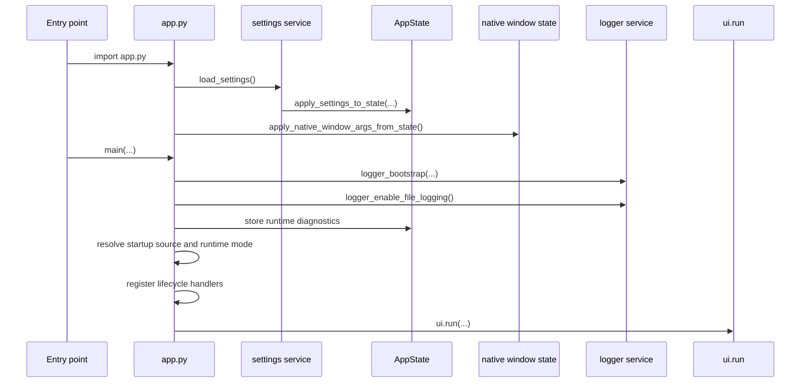

# ▶️ Execution Modes

This document explains the current ways to start the **NiceGui Windows Base** application.

---

## 🧭 Available modes

| Mode                | Command                           | Main purpose                                      |
| ------------------- | --------------------------------- | ------------------------------------------------- |
| Pyproject command   | `nicegui-windows-base`            | Normal execution after editable install           |
| Module execution    | `python -m desktop_app`           | Validate package execution                        |
| Direct script       | `python src\desktop_app\app.py`   | Quick diagnostic execution after editable install |
| Development runner  | `python dev_run.py`               | Browser mode with reload                          |
| Packaged executable | `.\dist\nicegui-windows-base.exe` | Windows executable generated by packaging         |

All Python execution modes assume that the virtual environment is active and the project was installed in editable mode with:

```powershell
python -m pip install -e ".[dev,packaging]"
```

---

## 🧭 Package and command names

The internal Python package is:

```text
src\desktop_app
```

The public command is configured separately in `pyproject.toml`:

```powershell
nicegui-windows-base
```

This separation is intentional. The template keeps `desktop_app` stable so new projects can change their public name without renaming the internal package.

See the root [README](../README.md#-naming-model) for the complete naming model.

---

## 🚀 Startup sequence

All execution modes converge into `desktop_app.app.main(...)`.



The startup message is built once and reused by logs, state, and the visible page. When console logging is enabled, the same message also appears in the terminal.

---

## 🖥️ Normal native execution

```powershell
nicegui-windows-base
```

Expected behavior:

- native mode enabled;
- reload disabled;
- startup source reported as `pyproject command`;
- port selected dynamically for native mode;
- settings loaded before logging is finalized;
- native window position prepared before `ui.run(...)` creates the desktop window.

Expected message shape:

```text
NiceGui Windows Base is starting from the pyproject command in native mode with reload disabled.
```

---

## 📦 Module execution

```powershell
python -m desktop_app
```

This uses:

```text
src\desktop_app\__main__.py
```

Expected message shape:

```text
NiceGui Windows Base is starting from module execution in native mode with reload disabled.
```

---

## 📄 Direct script execution

```powershell
python src\desktop_app\app.py
```

Expected message shape:

```text
NiceGui Windows Base is starting from direct script execution in native mode with reload disabled.
```

This is useful for diagnostics after the editable install is complete. For regular use, prefer `nicegui-windows-base` or `python -m desktop_app`.

---

## 🌐 Browser development mode

```powershell
python dev_run.py
```

`dev_run.py` calls:

```python
main(development_mode=True)
```

Then `main(...)` receives the mode selected by `get_nicegui_modes(...)`:

```python
if development_mode:
    return False, True

return True, False
```

Expected behavior:

- native mode disabled;
- reload enabled;
- port uses the configured web port, currently `8080`;
- reload watches `src` and `dev_run.py`;
- runtime source is shown as `the development runner`.

Expected message shape:

```text
NiceGui Windows Base is starting from the development runner in web mode with reload enabled.
```

Use this mode while editing the interface because browser mode with reload gives faster visual feedback.

### Windows multiprocessing guard

`dev_run.py` must keep this guard:

```python
if __name__ in {"__main__", "__mp_main__"}:
    main(development_mode=True)
```

NiceGUI reload mode can use multiprocessing on Windows. The internal `__mp_main__` name is not shown in the startup message; the user-facing source remains `the development runner`.

---

## 📦 Packaged executable

After packaging:

```powershell
.\dist\nicegui-windows-base.exe
```

Expected behavior:

- native mode enabled;
- reload disabled;
- console disabled by PyInstaller `--windowed`;
- log file written next to the executable;
- persistent `settings.toml` resolved next to the executable;
- bundled default `settings.toml` available as fallback;
- PyInstaller splash screen closes after the first client connects.

Expected message shape:

```text
NiceGui Windows Base is starting from the packaged executable in native mode with reload disabled.
```

---

## 🔌 Runtime ports

Port selection is centralized in `get_runtime_port(...)`.

| Runtime mode         | Port behavior                              |
| -------------------- | ------------------------------------------ |
| Native mode          | Uses NiceGUI native open-port discovery.   |
| Web development mode | Uses `DEFAULT_WEB_PORT`, currently `8080`. |

This avoids fixed-port conflicts in native desktop mode while keeping browser development predictable.

---

## 🖨️ Startup source detection

Startup source detection is implemented in:

```text
src\desktop_app\core\runtime.py
```

| Source              | How it is identified                                      |
| ------------------- | --------------------------------------------------------- |
| `dev_run.py`        | `development_mode=True`                                   |
| `package`           | `is_frozen_executable()` checks PyInstaller runtime state |
| `pyproject command` | command created by `[project.scripts]` starts the app     |
| `module`            | `python -m desktop_app` starts the app                    |
| `script`            | `src\desktop_app\app.py` starts directly                  |

`app.py` only orchestrates the result. Runtime details are resolved in `application/runtime_context.py`, `ui.run(...)` options are built in `application/run_options.py`, and the page itself is composed by `ui/main_page.py`.

---

## ⚙️ Settings during execution

Settings are loaded before the main runtime sequence continues.

The default template lives at:

```text
src\desktop_app\settings.toml
```

Persistent settings are resolved by runtime root:

| Runtime                 | Persistent settings path                    |
| ----------------------- | ------------------------------------------- |
| Normal Python execution | `<current-working-directory>\settings.toml` |
| Environment override    | `%DESKTOP_APP_ROOT%\settings.toml`          |
| Packaged executable     | `<executable-directory>\settings.toml`      |

Missing persistent settings are allowed. Bundled defaults are used until the application saves persistent settings.

See:

- [Settings subsystem](settings.md)
- [Application state](state.md)

---

## 🪟 Native window geometry during execution

In native mode, the application uses the `window` settings group to restore and
persist geometry.

`x`, `y`, `width`, `height`, and `fullscreen` are assigned to `app.native.window_args` before `main()` starts so the values are available before the native pywebview window is created. Window geometry is intentionally not passed through `ui.run(...)` to avoid competing startup sources.

During runtime, native `moved` and `resized` events update `AppState.window`.
The settings file is not written for every event. The application saves only the
`window` group when the native window closes or when shutdown runs.

Before applying saved coordinates, Windows monitor work areas are enumerated.
Only `x` and `y` are adjusted: values beyond 90% of the selected work area are
limited to that 90% point, and values that would leave less than 10% visible to
the left or above are moved to the start of the selected work area. Saved width
and height are not reduced by this monitor safety check. Browser development
mode skips this behavior because no native desktop window is created.

See [Native window persistence](native_window_persistence.md).

---

## 🧊 Packaged execution entry point

The packaged executable uses the standard Windows-safe entry point with `freeze_support()`:

```python
if __name__ == "__main__":
    freeze_support()
    main()
```

`freeze_support()` is intentionally present because the application is packaged for Windows. The `__mp_main__` guard remains limited to `dev_run.py`, where reload mode can use multiprocessing during development.

---

## 🖨️ Startup message in the page

`application/runtime_context.py` builds the startup message once during `main(...)`.

The same message is used for:

- logger output through the configured console/file handlers;
- `AppState.runtime.startup_message`;
- the NiceGUI page, displayed after `NiceGui Windows Base`.

This avoids duplicated formatting logic and keeps runtime diagnostics aligned with the visible UI.

---

## 📜 Runtime log narrative

The log is written as a readable operational story. Important milestones stay at `INFO`, while technical evidence stays at `DEBUG`.

Typical packaged execution flow:

```text
Logging initialized for NiceGui Windows Base.
Native window startup prepared through app.native.window_args only: size=(1024, 720), position=(100, 100), fullscreen=False, persist_state=True.
Starting NiceGui Windows Base startup sequence.
Startup source resolved: the packaged executable.
Runtime mode resolved: native mode with reload disabled.
Starting NiceGUI runtime in native mode on port 53124.
NiceGUI runtime started.
Native window opened.
Building the main page for the connected client.
Main page built successfully.
Native window finished loading.
Native window state persisted successfully.
The native window was closed by the user.
Client disconnected from the application.
Application shutdown completed.
```

Repeated native window events such as resize and move are logged at `DEBUG` to keep the main story readable. Geometry updates are captured in `AppState.window` and saved on close or shutdown. In browser development mode, native window handlers are skipped because no native desktop window is active.

For the internal logger architecture, early startup buffering, settings integration, and file rotation behavior, see [Logging subsystem](logging.md).

---

## 🖼️ Application icon

`application/run_options.py` passes the project icon to NiceGUI with `ui.run(favicon=...)`.

The icon path is resolved by `get_application_icon_path()` so it works in normal execution and in the packaged executable.

On Windows, NiceGUI can use a file-path favicon as the native window icon when the file is an `.ico` file. The executable icon is configured separately in the packaging script with PyInstaller `--icon`.

---

## 🖼️ Page image and layout

The main page displays a PNG illustration from:

```text
src\desktop_app\assets\page_image.png
```

The UI uses a centered card layout with the image, the application title, a short description, and the startup status message.

`ui/main_page.py` resolves the image path through `resolve_asset_path(...)`, which supports both normal execution and packaged execution.

---

## 🖼️ Packaged splash screen

The packaged executable uses the dedicated light-background PNG image as a PyInstaller splash screen:

```text
src\desktop_app\assets\splash_light.png
```

The splash screen is configured by [Windows packaging](packaging_windows.md). When `sys.frozen` is true, `register_splash_handler()` imports the optional `pyi_splash` module during startup and registers `close_splash_once()` with `app.on_connect(...)` before `ui.run(...)` starts. The handler closes the already-imported splash module on the first client connection and uses an internal flag to avoid repeated close attempts during reconnects.

---

## 🔗 Related documents

- [Development environment](development_environment.md)
- [Settings subsystem](settings.md)
- [Application state](state.md)
- [Native window persistence](native_window_persistence.md)
- [Windows packaging](packaging_windows.md)
- [Troubleshooting](troubleshooting.md)
