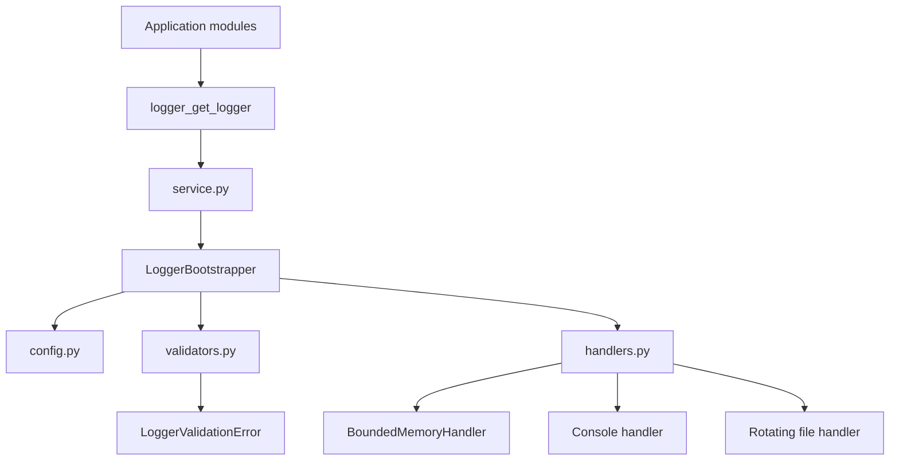
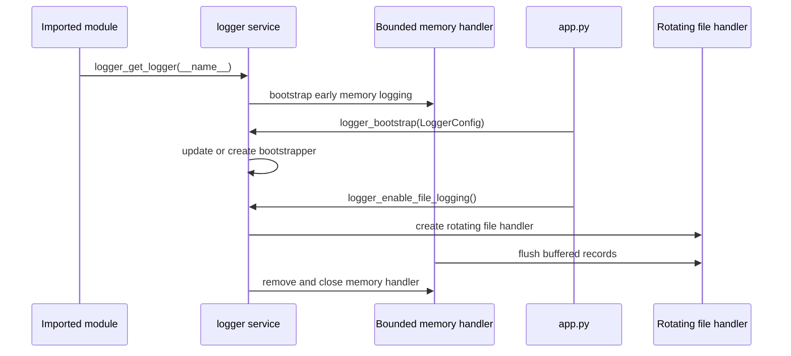

# 🖨️ Logging Subsystem

This guide explains how the **NiceGui Windows Base** logging subsystem works and how maintainers should use it safely.

The logger implementation lives in:

```text
src\desktop_app\infrastructure\logger
```

Use this guide when you need to understand startup logs, add new log messages, change rotation settings, diagnose packaged execution, or maintain the logger package.

---

## 🎯 Goals

The logging subsystem is designed to:

- keep startup diagnostics available even before the final log file is ready;
- avoid duplicated handlers and duplicated log lines;
- write readable runtime logs in normal Python execution and packaged execution;
- rotate log files to avoid uncontrolled growth;
- release file handlers during shutdown, which is especially important on Windows;
- keep logger usage simple for application modules.

It is intentionally more structured than a direct `logging.basicConfig(...)` call because this desktop template needs reliable logs across editable execution, browser development mode, and PyInstaller one-file builds.

---

## 🧭 Public API

Application modules should import logging functions from the package API:

```python
from desktop_app.infrastructure.logger import logger_get_logger

logger = logger_get_logger(__name__)
```

The public API is declared in:

- [`src/desktop_app/infrastructure/logger/__init__.py`](../src/desktop_app/infrastructure/logger/__init__.py)

Important public symbols:

| Symbol                            | Purpose                                                      |
| --------------------------------- | ------------------------------------------------------------ |
| `LoggerConfig`                    | Stores logger configuration values.                          |
| `LoggerBootstrapper`              | Controls handlers, buffering, file activation, and shutdown. |
| `LoggerValidationError`           | Represents invalid logger configuration values.              |
| `logger_get_logger(...)`          | Returns the application root logger or child logger.         |
| `logger_bootstrap(...)`           | Initializes or updates the global logger.                    |
| `logger_enable_file_logging(...)` | Activates rotating file logging and flushes early records.   |
| `logger_shutdown()`               | Releases handlers during application shutdown.               |

Most application code should only need `logger_get_logger(...)`.

---

## 🏗️ Module responsibilities



| File                                                                          | Responsibility                                                              |
| ----------------------------------------------------------------------------- | --------------------------------------------------------------------------- |
| [`__init__.py`](../src/desktop_app/infrastructure/logger/__init__.py)         | Exposes the official logger API.                                            |
| [`service.py`](../src/desktop_app/infrastructure/logger/service.py)           | Owns the global bootstrapper instance and helper functions.                 |
| [`bootstrapper.py`](../src/desktop_app/infrastructure/logger/bootstrapper.py) | Coordinates logger setup, handler lifecycle, file activation, and shutdown. |
| [`config.py`](../src/desktop_app/infrastructure/logger/config.py)             | Defines the `LoggerConfig` data container.                                  |
| [`validators.py`](../src/desktop_app/infrastructure/logger/validators.py)     | Normalizes levels, paths, buffer sizes, rotation sizes, and backup counts.  |
| [`handlers.py`](../src/desktop_app/infrastructure/logger/handlers.py)         | Creates console, memory, and rotating file handlers.                        |
| [`exceptions.py`](../src/desktop_app/infrastructure/logger/exceptions.py)     | Declares `LoggerValidationError`.                                           |

---

## 🚀 Startup flow

`app.py` configures logging through `configure_logging()` before the application startup sequence continues.



Why this matters:

1. Some modules create loggers during import.
2. At that moment, the final log file path may not be known yet.
3. Early records are kept in a bounded memory handler.
4. Once `app.py` resolves the runtime log path, file logging is enabled.
5. The early records are flushed into the rotating log file.

This prevents losing important startup records without allowing unbounded memory growth.

---

## 📁 Log file location

The runtime log file is configured by constants in:

- [`src/desktop_app/constants.py`](../src/desktop_app/constants.py)

Current default:

```python
LOG_FILE_PATH = Path("logs") / "app.log"
```

`app.py` resolves the final location as follows:

| Runtime                 | Log location                               |
| ----------------------- | ------------------------------------------ |
| Normal Python execution | `<current-working-directory>\logs\app.log` |
| PyInstaller executable  | `<executable-directory>\logs\app.log`      |

The packaged executable uses a log directory next to the executable so users and maintainers can inspect runtime diagnostics without opening a console window.

---

## 🧱 Handler model

The logger may use three handler types during its lifecycle.

### 🧠 Bounded memory handler

`BoundedMemoryHandler` stores early log records before file logging is active.

Key behavior:

- keeps only the most recent records;
- avoids unbounded memory growth;
- flushes records to the rotating file handler when file logging starts;
- is removed after file logging is enabled.

### 💻 Console handler

The console handler is useful during normal Python execution.

In packaged execution, console logging is disabled because the executable is built with PyInstaller `--windowed` and should not open an extra terminal window.

### 📄 Rotating file handler

The file handler writes UTF-8 logs and rotates them using values from `constants.py`:

```python
DEFAULT_ROTATE_MAX_BYTES = 5 * 1024 * 1024
DEFAULT_ROTATE_BACKUP_COUNT = 3
```

This keeps:

- `app.log`
- `app.log.1`
- `app.log.2`
- `app.log.3`

when rotation is triggered.

---

## 📏 Log rotation size limits

`rotate_max_bytes` defines the maximum size of the active log file before rotation.

The logger accepts the value as an integer number of bytes or as a readable string handled by the validator layer, such as:

```text
5 MB
512KB
1 GB
```

Current rotation size limits:

| Setting               |   Value |           Bytes | Purpose                                                       |
| --------------------- | ------: | --------------: | ------------------------------------------------------------- |
| Minimum accepted size | `1 MiB` |     `1,048,576` | Prevents excessively frequent rotation and noisy file churn.  |
| Default size          | `5 MiB` |     `5,242,880` | Keeps logs useful while limiting disk usage for desktop runs. |
| Maximum accepted size | `1 GiB` | `1,073,741,824` | Prevents accidental creation of very large log files.         |

Recommended behavior:

- keep the default `5 MiB` for normal desktop usage;
- reduce the value only when disk space is very limited;
- increase the value only when diagnosing verbose `DEBUG` logs;
- avoid values below `1 MiB`, because they are rejected by validation.

Example:

```python
LoggerConfig(
    rotate_max_bytes="5 MB",
    rotate_backup_count=3,
)
```

---

## 📜 Log levels and narrative

The project separates operational narrative from technical evidence:

| Level       | Use for                                                   |
| ----------- | --------------------------------------------------------- |
| `INFO`      | Runtime milestones that explain the main execution story. |
| `DEBUG`     | Technical evidence useful during diagnosis.               |
| `WARNING`   | Recoverable problems or degraded behavior.                |
| `ERROR`     | Runtime failures that require attention.                  |
| `EXCEPTION` | Errors where traceback should be preserved.               |

Examples of `INFO` messages:

```text
Logging initialized for NiceGui Windows Base.
Starting NiceGui Windows Base startup sequence.
Startup source resolved: the packaged executable.
Runtime mode resolved: native mode with reload disabled.
Starting NiceGUI runtime in native mode on port 8000.
NiceGUI runtime started.
Application shutdown completed.
```

Examples of `DEBUG` evidence:

```text
Application working directory: ...
Python executable in use: ...
PyInstaller extraction directory marker: ...
Page image resolved for the main page: ...
Native window lifecycle handlers registered.
```

See also:

- [Execution modes](execution_modes.md#-runtime-log-narrative)
- [Troubleshooting](troubleshooting.md)

---

## ✅ How to add log messages

Use one logger per module:

```python
from desktop_app.infrastructure.logger import logger_get_logger

logger = logger_get_logger(__name__)
```

Recommended patterns:

```python
logger.info("Starting file synchronization.")
logger.debug("Resolved source directory: %s", source_dir)
logger.warning("Remote service is unavailable; retry will be attempted later.")
logger.exception("Unexpected failure during file synchronization.")
```

Avoid:

```python
logger.info(f"Resolved source directory: {source_dir}")
```

Prefer `%s` placeholders so formatting is deferred until the record is actually emitted.

---

## 🔐 Sensitive data rules

Do not log sensitive values, such as:

- passwords;
- access tokens;
- SAP credentials;
- SharePoint secrets;
- full personal identifiers;
- confidential document contents.

When diagnosing integrations, log stable technical context instead:

```python
logger.debug("SharePoint target library resolved: %s", library_name)
logger.info("SAP export completed successfully.")
logger.warning("SAP session was not available; user action is required.")
```

For SAP GUI, RPA, and SharePoint integrations, keep logs useful for support without exposing business data.

---

## ⚙️ Configuration rules

Logger configuration uses `LoggerConfig`:

```python
LoggerConfig(
    level="INFO",
    enable_console=True,
    file_path=Path("logs") / "app.log",
    rotate_max_bytes="5 MB",
    rotate_backup_count=3,
)
```

The validator layer accepts sizes as integers or strings such as:

```text
5 MB
512KB
1 GB
```

The logger name cannot be changed after bootstrapper creation. This prevents handler duplication and keeps child logger names stable.

---

## 🧪 Maintenance checklist

When changing the logger package, validate at least:

```powershell
python -m compileall -q src dev_run.py
ruff check .
ruff format --check .
```

Then run the main execution modes:

```powershell
nicegui-windows-base
python -m desktop_app
python dev_run.py
```

For packaging behavior, run:

```powershell
.\scripts\package_windows.ps1
.\dist\nicegui-windows-base.exe
```

Confirm that:

- `logs\app.log` is created;
- startup records are not duplicated;
- the packaged executable opens without an extra console window;
- shutdown releases the log file;
- `INFO` messages tell the main runtime story;
- `DEBUG` messages contain useful technical evidence.

---

## 🧯 Common issues

### Logs appear duplicated

Likely causes:

- a module added handlers directly through the standard `logging` API;
- `logging.basicConfig(...)` was introduced somewhere else;
- the global bootstrapper was bypassed.

Fix:

- use `logger_get_logger(__name__)`;
- keep handler creation inside `handlers.py`;
- keep global lifecycle control inside `service.py` and `bootstrapper.py`.

### No log file is created

Check:

- whether `logger_enable_file_logging()` returned `False`;
- whether the target directory is writable;
- whether the packaged executable can write next to `dist\nicegui-windows-base.exe`;
- whether security software is blocking file creation.

### Log file is locked on Windows

Confirm that application shutdown calls:

```python
logger_shutdown()
```

This is currently wired through [lifecycle handlers](../src/desktop_app/infrastructure/lifecycle.py).

---

## 🔗 Related documents

- [Documentation index](README.md)
- [Execution modes](execution_modes.md)
- [Windows packaging](packaging_windows.md)
- [Troubleshooting](troubleshooting.md)
- [Code quality with Ruff](code_quality.md)
