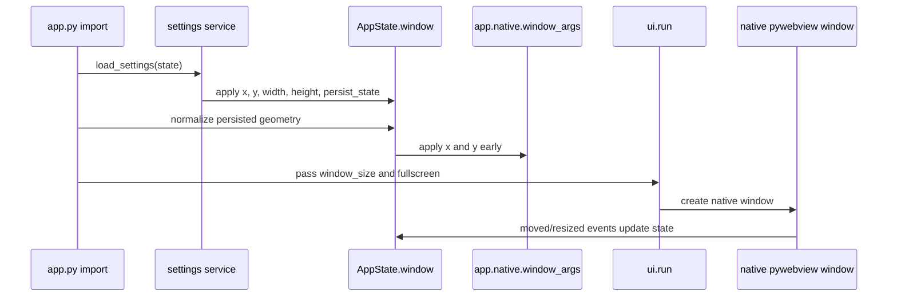
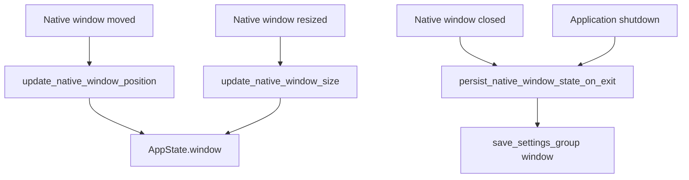

# 🪟 Native Window Persistence

This guide explains how **NiceGui Windows Base** restores, captures, validates, and saves the native desktop window position and size.

The implementation lives in:

```text
src\desktop_app\infrastructure\native_window_state.py
```

Lifecycle integration lives in:

```text
src\desktop_app\infrastructure\lifecycle.py
```

Related persisted values are documented in [Settings subsystem](settings.md) and the in-memory model is documented in [Application state](state.md).

---

## 🎯 Goals

Native window persistence is designed to:

- restore the last native window size and position when the application starts;
- keep callbacks in `lifecycle.py` small and delegate geometry logic to infrastructure code;
- update `AppState.window` from real native move and resize events;
- save only the `window` settings group when the application exits;
- avoid writing the settings file on every resize or move event;
- prevent monitor changes from leaving the application outside the visible desktop;
- support multi-monitor Windows setups, including monitors with negative virtual-screen coordinates.

---

## ⚙️ User setting

Window persistence is controlled by:

```toml
[app.window]
persist_state = true
```

When the value is `true`, the application restores and saves geometry.

When the value is `false`, the application resets persisted geometry to the defaults from `WindowState` and saves the `window` group. This prevents stale coordinates from being reused when persistence is enabled again later.

---

## 🧭 Startup flow

The application applies native window position before `main()` starts.



Important detail: `x` and `y` are applied through `app.native.window_args` before `ui.run(...)` creates the native window. `window_size` and `fullscreen` remain part of the `ui.run(...)` options.

---

## 🖥️ Multi-monitor safety

Persisted coordinates can become unsafe when monitors are disconnected, reordered, moved in Windows display settings, or replaced by monitors with different resolutions.

The application handles this by using Windows monitor work areas:

1. enumerate monitors through Win32 `EnumDisplayMonitors`;
2. read each monitor `rcWork` through `GetMonitorInfoW`;
3. select the monitor that most overlaps the persisted window;
4. if the persisted window is outside every monitor, select the nearest monitor;
5. clamp `x` and `y` inside safe 10% and 90% guard rails for that monitor.

The guard rails are applied per axis:

| Axis | Rule |
| ---- | ---- |
| `x`  | If `x` is greater than 90% of the monitor work-area width, clamp it to 90%. |
| `x`  | If `x + width` is before 10% of the monitor work-area width, move `x` to 10%. |
| `y`  | If `y` is greater than 90% of the monitor work-area height, clamp it to 90%. |
| `y`  | If `y + height` is before 10% of the monitor work-area height, move `y` to 10%. |

The calculation uses the monitor work-area origin, so it supports monitors positioned to the left or above the primary monitor where coordinates can be negative.

---

## 🔄 Runtime event flow

Native lifecycle handlers update in-memory state only. They do not save the file on every event.



This avoids excessive disk writes while keeping the final state ready for persistence.

---

## 💾 Save behavior

On native window close and application shutdown, the application:

1. refreshes `AppState.window` from the latest native event or native window object when possible;
2. updates `last_saved_at`;
3. saves only the `window` settings group;
4. keeps unrelated settings untouched.

The saved values are:

```toml
[app.window]
x = 100
y = 100
width = 1024
height = 720
maximized = false
fullscreen = false
monitor = 0
persist_state = true
storage_key = "nicegui_windows_base_window_state"
```

---

## 🧪 Validation commands

Run focused tests after changing this feature:

```powershell
pytest tests/infrastructure/test_native_window_state.py
pytest tests/infrastructure/test_lifecycle.py
pytest tests/infrastructure/settings/test_mapper.py
pytest tests/infrastructure/settings/test_toml_document.py
```

Run the broader safety checks before committing:

```powershell
python -m compileall -q src dev_run.py
pytest
ruff check .
ruff format --check .
```

---

## 🧯 Troubleshooting

### Window opens outside the visible area

Edit the persistent runtime file, not the bundled template:

```text
settings.toml
```

Set:

```toml
[app.window]
persist_state = false
```

Start the application once. The geometry should be reset to defaults and saved back to the file.

### Manual TOML changes are ignored

Confirm you edited the correct runtime file:

| Runtime | File to edit |
| ------- | ------------ |
| Normal Python execution | `<repository-root>\settings.toml` |
| Packaged executable | `<executable-directory>\settings.toml` |
| Custom root | `%DESKTOP_APP_ROOT%\settings.toml` |

The bundled file at `src\desktop_app\settings.toml` is the default template, not the normal runtime settings file.

### Position changes are saved but not restored

Confirm native mode is active. Browser development mode does not create a native desktop window, so native geometry is not restored there.

---

## 🔗 Related documents

- [Settings subsystem](settings.md)
- [Application state](state.md)
- [Execution modes](execution_modes.md)
- [Troubleshooting](troubleshooting.md)
