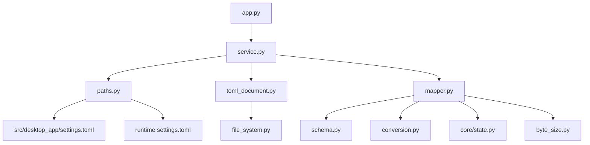
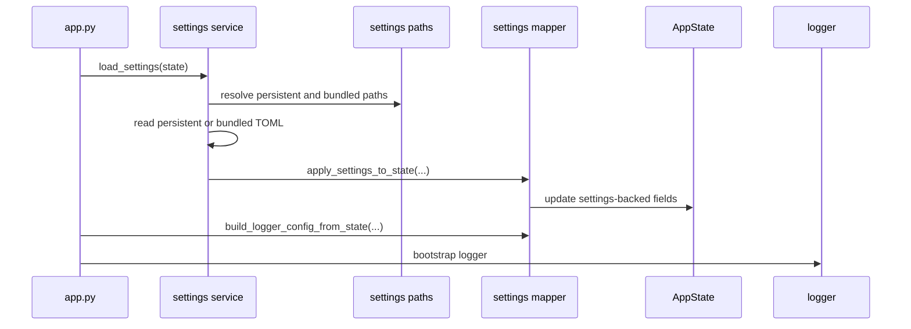

# ⚙️ Settings Subsystem

This guide explains how `settings.toml` is loaded, validated, mapped into application state, and saved.

The settings implementation lives in:

```text
src\desktop_app\infrastructure\settings
```

The bundled default template lives in:

```text
src\desktop_app\settings.toml
```

---

## 🎯 Goals

The settings subsystem is designed to:

- start safely even when the user has no persistent `settings.toml`;
- keep default settings bundled with the package and executable;
- store user-editable values in a persistent runtime file;
- preserve TOML comments and structure when possible;
- support scoped saves for specific settings groups;
- validate settings before applying them to `AppState`;
- keep settings logic separate from NiceGUI UI code;
- keep infrastructure code testable without starting the application.

---

## 🏗️ Module responsibilities



| File                                                                              | Responsibility                                                    |
| --------------------------------------------------------------------------------- | ----------------------------------------------------------------- |
| [`__init__.py`](../src/desktop_app/infrastructure/settings/__init__.py)           | Exposes the official settings API.                                |
| [`service.py`](../src/desktop_app/infrastructure/settings/service.py)             | Coordinates load and save operations.                             |
| [`paths.py`](../src/desktop_app/infrastructure/settings/paths.py)                 | Resolves persistent and bundled settings paths.                   |
| [`schema.py`](../src/desktop_app/infrastructure/settings/schema.py)               | Defines supported groups and property paths.                      |
| [`mapper.py`](../src/desktop_app/infrastructure/settings/mapper.py)               | Maps TOML values into `AppState` and builds logger configuration. |
| [`conversion.py`](../src/desktop_app/infrastructure/settings/conversion.py)       | Converts raw TOML values into typed Python values.                |
| [`toml_document.py`](../src/desktop_app/infrastructure/settings/toml_document.py) | Reads, updates, removes, and writes TOML documents.               |

---

## 📁 Settings files

### Bundled default template

The project ships with:

```text
src\desktop_app\settings.toml
```

This file is included in the Python package through `pyproject.toml` package data and bundled into the executable by `scripts\package_windows.ps1`.

It contains the default structure:

```toml
[app]
name = "NiceGui Windows Base"
version = "0.4.0"
language = "en-US"
first_run = true

[app.window]
x = 100
y = 100
width = 1024
height = 720
maximized = false
fullscreen = false
monitor = 0
storage_key = "nicegui_windows_base_window_state"

[app.ui]
theme = "light"
font_scale = 1.0
dense_mode = false
accent_color = "#2563EB"

[app.log]
level = "INFO"
enable_console = true
buffer_capacity = 500
file_path = "logs/app.log"
rotate_max_bytes = "5 MB"
rotate_backup_count = 3

[app.behavior]
auto_save = true
```

### Persistent runtime file

The persistent settings file is resolved at runtime.

| Runtime                 | Persistent file                             |
| ----------------------- | ------------------------------------------- |
| Normal Python execution | `<current-working-directory>\settings.toml` |
| Environment override    | `%DESKTOP_APP_ROOT%\settings.toml`          |
| PyInstaller executable  | `<executable-directory>\settings.toml`      |

Missing persistent settings are expected during first run. The application uses bundled defaults until settings are saved.

---

## 🧭 Path resolution

`resolve_default_settings_path()` returns the persistent file path.

`resolve_settings_root()` chooses the base folder in this order:

1. `DESKTOP_APP_ROOT`, when set;
2. executable directory, when running as a frozen executable;
3. current working directory during normal Python execution.

Bundled defaults are searched in packaging-safe candidate paths, including the PyInstaller extraction folder and the installed package folder.

---

## 🚀 Startup flow

`app.py` calls `configure_logging()` early during startup. That function loads settings before final logger setup.



---

## 🧩 Supported settings groups

Settings are organized by groups in [`schema.py`](../src/desktop_app/infrastructure/settings/schema.py).

| Group      | Property paths                                                                                                                                                           |
| ---------- | ------------------------------------------------------------------------------------------------------------------------------------------------------------------------ |
| `meta`     | `app.name`, `app.version`, `app.language`, `app.first_run`                                                                                                               |
| `window`   | `app.window.x`, `app.window.y`, `app.window.width`, `app.window.height`, `app.window.maximized`, `app.window.fullscreen`, `app.window.monitor`, `app.window.storage_key` |
| `ui`       | `app.ui.theme`, `app.ui.font_scale`, `app.ui.dense_mode`, `app.ui.accent_color`                                                                                          |
| `log`      | `app.log.level`, `app.log.enable_console`, `app.log.buffer_capacity`, `app.log.file_path`, `app.log.rotate_max_bytes`, `app.log.rotate_backup_count`                     |
| `behavior` | `app.behavior.auto_save`                                                                                                                                                 |

Legacy log paths are also recognized for cleanup and migration support:

- `app.log.name`;
- `app.log.console`.

---

## 🔄 Load behavior

The load process:

1. resolves the persistent settings file path;
2. searches for a bundled default file;
3. reads persistent settings when they exist;
4. falls back to bundled defaults when persistent settings are missing;
5. maps known values into `AppState`;
6. stores settings path diagnostics in state;
7. logs recoverable problems without exposing sensitive data.

Invalid or missing values should not crash normal startup when safe defaults exist.

---

## 💾 Save behavior

The save process supports scoped saves.

Typical save scopes:

```python
save_settings(state, groups=("ui",))
save_settings(state, groups=("window", "behavior"))
save_settings(state)
```

A scoped save updates only the selected groups. This avoids rewriting unrelated values when a small UI setting changes.

The TOML writer should preserve useful comments and existing structure when possible, while still removing unsupported legacy keys when needed.

---

## 🧪 Validation and conversion

Raw TOML values are converted before entering `AppState`.

Examples:

| Setting                    | Expected type                  |
| -------------------------- | ------------------------------ |
| `app.window.x`             | `int`                          |
| `app.window.maximized`     | `bool`                         |
| `app.ui.theme`             | `light`, `dark`, or `system`   |
| `app.ui.font_scale`        | `float`                        |
| `app.log.level`            | logging level string           |
| `app.log.rotate_max_bytes` | `int` bytes or readable string |
| `app.behavior.auto_save`   | `bool`                         |

The logger rotation value supports readable sizes such as:

```text
5 MB
512KB
1 GB
```

Byte-size parsing is centralized in:

```text
src\desktop_app\infrastructure\byte_size.py
```

---

## 🧠 Relationship with AppState

Settings are applied to the shared `AppState`.

The state model lives in:

```text
src\desktop_app\core\state.py
```

Settings-backed sections include:

- `meta`;
- `window`;
- `ui`;
- `log`;
- `behavior`;
- `settings`;
- `settings_validation`.

Runtime-only sections include:

- `runtime`;
- `paths`;
- `ui_session`;
- `assets`;
- `lifecycle`;
- `status`.

See [Application state](state.md) for the complete state model.

---

## 🧼 Legacy and unsupported keys

The settings subsystem should not keep unsupported keys indefinitely.

Legacy log keys currently recognized for cleanup include:

```text
app.log.name
app.log.console
```

When the persistent TOML is updated, old keys should be removed so future maintenance is easier.

---

## 🛠️ Adding a new setting

Use this checklist when adding a setting:

1. Add the default value to `src\desktop_app\settings.toml`.
2. Add a field to the appropriate dataclass in `core/state.py`.
3. Add the property path to `schema.py`.
4. Add conversion and validation in `mapper.py` or `conversion.py`.
5. Include the setting in save/update logic.
6. Add tests for loading valid values.
7. Add tests for invalid values and fallback behavior.
8. Update this document.
9. Update [Application state](state.md) if the state model changes.
10. Update [First run checklist](first_run_checklist.md) when manual validation changes.

---

## 🧪 Maintenance commands

Run these commands after changing settings code:

```powershell
python -m compileall -q src dev_run.py
pytest tests/infrastructure/settings
pytest tests/core/test_state.py
ruff check .
ruff format --check .
```

Run the application at least once:

```powershell
nicegui-windows-base
```

For packaging behavior:

```powershell
.\scripts\package_windows.ps1
.\dist\nicegui-windows-base.exe
```

Confirm that packaged execution can load bundled defaults.

---

## 🧯 Common issues

### Persistent settings file is missing

This is normal during first run. The bundled default template is used.

### Settings are written to an unexpected folder

Check:

```powershell
Get-ChildItem Env:\DESKTOP_APP_ROOT
```

When this environment variable is set, it intentionally changes the runtime root.

### Packaged executable ignores local edits

Confirm that you edited the persistent file next to the executable, not the bundled template inside the source tree.

### Invalid theme is ignored

`app.ui.theme` must be one of:

```text
light
dark
system
```

Invalid values should fall back to a safe default.

---

## 🔗 Related documents

- [Application state](state.md)
- [Execution modes](execution_modes.md)
- [Logging subsystem](logging.md)
- [Windows packaging](packaging_windows.md)
- [Troubleshooting](troubleshooting.md)
