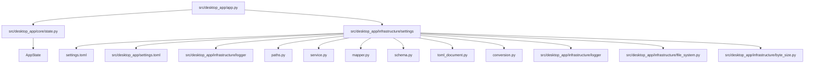
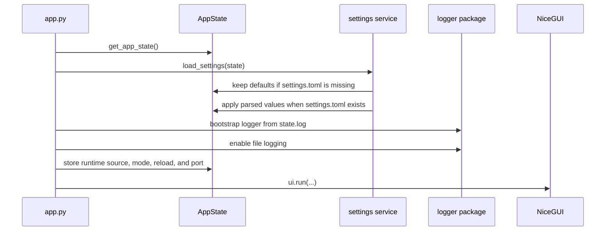
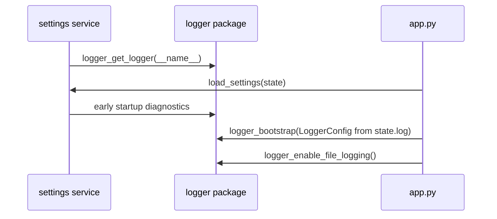

# ⚙️ Settings and Application State

This guide explains how **NiceGui Windows Base** manages runtime state and the persistent `settings.toml` file.

Use this document when you need to understand startup settings, add a new configurable value, diagnose packaged settings behavior, or maintain the state model.

---

## 🎯 Goals

The settings and state implementation is designed to:

- keep runtime state centralized in a small, typed model;
- keep pure state separate from file I/O;
- keep settings loading read-only when `settings.toml` is missing;
- preserve comments and unknown TOML keys when saving existing settings;
- load and save all settings, one settings group, or one individual property;
- support normal Python execution and PyInstaller one-file execution;
- let logging configuration be adjusted before final file logging starts;
- avoid coupling NiceGUI callbacks directly to TOML parsing or file writes.

---

## 🧭 Module responsibilities



| File                                                                                                                      | Responsibility                                                                             |
| ------------------------------------------------------------------------------------------------------------------------- | ------------------------------------------------------------------------------------------ |
| [`src/desktop_app/core/state.py`](../src/desktop_app/core/state.py)                                                       | Defines the typed in-memory `AppState` model.                                              |
| [`src/desktop_app/infrastructure/settings/__init__.py`](../src/desktop_app/infrastructure/settings/__init__.py)           | Exposes the public settings API.                                                           |
| [`src/desktop_app/infrastructure/settings/service.py`](../src/desktop_app/infrastructure/settings/service.py)             | Loads settings read-only, saves scoped settings, and creates `settings.toml` only on save. |
| [`src/desktop_app/infrastructure/settings/paths.py`](../src/desktop_app/infrastructure/settings/paths.py)                 | Resolves persistent and bundled settings paths.                                            |
| [`src/desktop_app/infrastructure/settings/mapper.py`](../src/desktop_app/infrastructure/settings/mapper.py)               | Converts TOML data into `AppState` and logger configuration.                               |
| [`src/desktop_app/infrastructure/settings/schema.py`](../src/desktop_app/infrastructure/settings/schema.py)               | Defines supported groups and property paths for scoped load/save operations.               |
| [`src/desktop_app/infrastructure/settings/toml_document.py`](../src/desktop_app/infrastructure/settings/toml_document.py) | Updates TOML documents while preserving comments and unknown keys.                         |
| [`src/desktop_app/infrastructure/settings/conversion.py`](../src/desktop_app/infrastructure/settings/conversion.py)       | Provides safe conversion helpers for manually edited values.                               |
| [`src/desktop_app/infrastructure/file_system.py`](../src/desktop_app/infrastructure/file_system.py)                       | Provides reusable parent-directory creation and atomic text writes.                        |
| [`src/desktop_app/infrastructure/byte_size.py`](../src/desktop_app/infrastructure/byte_size.py)                           | Parses human-readable byte-size values reused by logger and settings validation.           |
| [`src/desktop_app/settings.toml`](../src/desktop_app/settings.toml)                                                       | Bundled template used as the initial document when settings are saved for the first time.  |

---

## 🧠 Runtime state model

The central runtime state lives in:

```text
src/desktop_app/core/state.py
```

It is intentionally pure. It does not read files, write files, configure logging, or access NiceGUI.

Main sections:

| State section         | Purpose                                                                                   |
| --------------------- | ----------------------------------------------------------------------------------------- |
| `meta`                | Application name, version, language, and first-run flag.                                  |
| `runtime`             | Startup source, startup message, runtime mode, reload flag, and selected port.            |
| `paths`               | Effective settings, log, executable, working directory, and PyInstaller extraction paths. |
| `window`              | Future native window size and position preferences.                                       |
| `ui`                  | Theme, font scale, dense mode, and accent color preferences.                              |
| `ui_session`          | Transient UI state such as active view and busy message.                                  |
| `assets`              | Resolved runtime asset paths for diagnostics.                                             |
| `log`                 | Log preferences plus runtime status such as effective file path.                          |
| `behavior`            | General behavior preferences such as auto-save.                                           |
| `settings`            | Settings file existence, defaults usage, scopes, and latest load/save status.             |
| `settings_validation` | Warnings from the latest settings validation.                                             |
| `lifecycle`           | Application, client, native window, splash, and shutdown status flags.                    |
| `status`              | Current and recent status messages for future UI feedback.                                |

The module exposes a controlled singleton API:

```python
from desktop_app.core.state import get_app_state

state = get_app_state()
```

Use `reset_app_state()` mainly in tests or diagnostics. Avoid creating independent state instances unless a function explicitly accepts one.

For the complete state model and NiceGUI binding guidance, see [Application state](state.md).

---

## 🚀 Startup flow

At startup, `app.py` performs this sequence:



This allows persisted logging preferences to be applied before final file logging is enabled.

---

## 🎚️ Granular load and save

The settings service supports three scopes:

| Scope     | Load function                           | Save function                           | Example use                    |
| --------- | --------------------------------------- | --------------------------------------- | ------------------------------ |
| Full file | `load_settings()`                       | `save_settings()`                       | Startup or full persistence.   |
| Group     | `load_settings_group("ui")`             | `save_settings_group("ui")`             | Persist a settings page tab.   |
| Property  | `load_setting_property("app.ui.theme")` | `save_setting_property("app.ui.theme")` | Persist one UI control change. |

Examples:

```python
from desktop_app.infrastructure.settings import (
    load_setting_property,
    load_settings_group,
    save_setting_property,
    save_settings_group,
)

load_settings_group("window")
load_setting_property("app.ui.theme")

save_settings_group("log")
save_setting_property("app.window.width")
```

`load_settings()` and `save_settings()` still operate on the full file by default.
When saving a group or property, unknown TOML keys and unrelated known settings are preserved.

Do not pass a group and an individual property at the same time. The package raises `SettingsScopeError` for unsupported groups, unsupported property paths, or ambiguous scopes.

### Missing file behavior

Loading is intentionally read-only:

```text
load_settings() with no settings.toml -> keep in-memory defaults and return True
save_settings() with no settings.toml -> create settings.toml and save selected scope
```

This keeps startup side-effect free. `state.settings.file_exists` and `state.settings.using_defaults` make the active behavior explicit for diagnostics or a future settings page.

---

## 📁 Settings file locations

The settings package distinguishes between two files:

| File                | Purpose                    | Typical location                                                       |
| ------------------- | -------------------------- | ---------------------------------------------------------------------- |
| Bundled template    | First-run source template. | `src/desktop_app/settings.toml` or PyInstaller extraction folder.      |
| Persistent settings | Editable runtime settings. | Repository root during development or executable folder when packaged. |

Default persistent path:

```text
<application-root>/settings.toml
```

The application root is resolved as follows:

| Runtime                 | Root                                          |
| ----------------------- | --------------------------------------------- |
| Normal Python execution | Current working directory.                    |
| Packaged executable     | Folder containing `nicegui-windows-base.exe`. |
| Custom override         | `DESKTOP_APP_ROOT` environment variable.      |

---

## 📦 Packaged executable behavior

The packaging script bundles the settings template with PyInstaller:

```powershell
--add-data $settingsData
```

The bundled file is not edited directly. Startup does not create a persistent `settings.toml` automatically. When a save operation is requested for the first time, the application creates the persistent file next to the executable. This avoids unnecessary writes and keeps PyInstaller one-file extraction directories out of user-edited settings.

Related document:

- [Windows packaging](packaging_windows.md)

---

## 📝 Current `settings.toml` schema

```toml
[app]
name = "NiceGui Windows Base"
version = "0.3.4"
language = "en-US"
first_run = true

[app.window]
x = 100
y = 100
width = 1024
height = 720
maximized = false
fullscreen = false
monitor = 0
storage_key = "nicegui_windows_base_window_state"

[app.ui]
theme = "light"
font_scale = 1.0
dense_mode = false
accent_color = "#2563EB"

[app.log]
level = "INFO"
enable_console = true
buffer_capacity = 500
file_path = "logs/app.log"
rotate_max_bytes = "5 MB"
rotate_backup_count = 3

[app.behavior]
auto_save = true
```

---

## 🧪 Validation and recovery

The settings mapper uses defensive conversion. Invalid user-edited values are replaced with safe defaults and a status message is stored in `state.status`.

Examples:

| Invalid value             | Recovery               |
| ------------------------- | ---------------------- |
| Unknown theme             | Falls back to `light`. |
| Window width below `400`  | Falls back to `1024`.  |
| Window height below `300` | Falls back to `720`.   |
| Invalid log level         | Falls back to `INFO`.  |
| Invalid rotation size     | Falls back to `5 MB`.  |
| Invalid backup count      | Falls back to `3`.     |

This keeps startup resilient even when `settings.toml` was edited manually.

---

## 🧩 Shared helpers

Two small helpers are intentionally shared instead of duplicated:

| Helper                                                               | Used by                                            | Why it exists                                                       |
| -------------------------------------------------------------------- | -------------------------------------------------- | ------------------------------------------------------------------- |
| [`file_system.py`](../src/desktop_app/infrastructure/file_system.py) | settings persistence and logger file handler setup | Centralizes parent-directory creation and atomic text writes.       |
| [`byte_size.py`](../src/desktop_app/infrastructure/byte_size.py)     | logger validation and settings conversion          | Keeps byte-size parsing rules consistent for values such as `5 MB`. |

The settings package still owns TOML-specific behavior in [`toml_document.py`](../src/desktop_app/infrastructure/settings/toml_document.py). The logger package still owns logger-specific validation errors in [`validators.py`](../src/desktop_app/infrastructure/logger/validators.py). This avoids creating a broad utility layer while removing actual duplicated logic.

---

## 🖨️ Logger usage during settings startup

The settings service imports the official application logger with:

```python
from desktop_app.infrastructure.logger import logger_get_logger

logger = logger_get_logger(__name__)
```

This is safe during startup because the logger subsystem is intentionally able to work before the final file logging configuration is applied. Settings are loaded first, then `app.py` builds `LoggerConfig` from `state.log` and enables final file logging.

This keeps settings diagnostics aligned with the rest of the application while preserving the startup order:



---

## 🛠️ Adding a new setting

Use this checklist when adding a new configurable value:

1. Add the runtime field to [`state.py`](../src/desktop_app/core/state.py).
2. Add the default value to [`src/desktop_app/settings.toml`](../src/desktop_app/settings.toml).
3. Add the property path to the correct group in [`schema.py`](../src/desktop_app/infrastructure/settings/schema.py).
4. Read and validate the value in [`mapper.py`](../src/desktop_app/infrastructure/settings/mapper.py).
5. Write the value back in [`toml_document.py`](../src/desktop_app/infrastructure/settings/toml_document.py).
6. Update this document if the setting is user-editable or affects startup behavior.
7. Validate with Ruff and the main execution modes.

Recommended checks:

```powershell
python -m compileall -q src dev_run.py
ruff check .
ruff format --check .
```

Then run:

```powershell
nicegui-windows-base
python -m desktop_app
python dev_run.py
```

---

## 🔗 Related documents

- [Documentation index](README.md)
- [Execution modes](execution_modes.md)
- [Logging subsystem](logging.md)
- [Windows packaging](packaging_windows.md)
- [Troubleshooting](troubleshooting.md)
