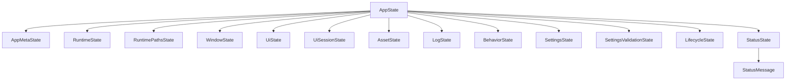
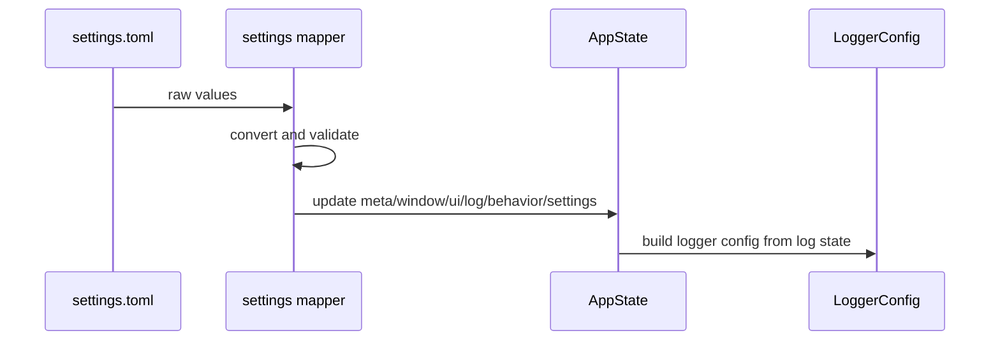

# 🧠 Application State

This guide explains the shared application state model used by **NiceGui Windows Base**.

The state implementation lives in:

```text
src\desktop_app\core\state.py
```

---

## 🎯 Goals

`AppState` is designed to:

- keep runtime diagnostics in one typed object;
- provide a stable target for settings loading and saving;
- avoid scattering global variables across modules;
- keep UI callbacks small by giving them a simple state model;
- make tests easier by allowing state reset and replacement;
- separate persisted settings from runtime-only information.

---

## 🧭 Public API

Application modules should use the state helpers:

```python
from desktop_app.core.state import get_app_state

state = get_app_state()
```

Common helpers:

| Symbol               | Purpose                                                            |
| -------------------- | ------------------------------------------------------------------ |
| `get_app_state()`    | Returns the shared application state singleton.                    |
| `set_app_state(...)` | Replaces the shared state, mainly for tests or controlled startup. |
| `reset_app_state()`  | Resets the shared state to defaults.                               |
| `AppState`           | Root dataclass containing all state sections.                      |
| `StatusLevel`        | Literal type for status severity values.                           |
| `ThemeName`          | Literal type for supported UI themes.                              |

---

## 🏗️ State sections

`AppState` groups related data into focused dataclasses.



| Section               | Dataclass                 | Purpose                                                                                                                    |
| --------------------- | ------------------------- | -------------------------------------------------------------------------------------------------------------------------- |
| `meta`                | `AppMetaState`            | Application name, version, language, and first-run flag.                                                                   |
| `runtime`             | `RuntimeState`            | Startup source, startup message, native mode flag, reload flag, and selected port.                                         |
| `paths`               | `RuntimePathsState`       | Resolved settings path, log path, executable path, working directory, and PyInstaller temp directory.                      |
| `window`              | `WindowState`             | Native window position, size, fullscreen/maximized flags, monitor, persistence flag, storage key, and last-save timestamp. |
| `ui`                  | `UiState`                 | Theme, font scale, dense mode, and accent color.                                                                           |
| `ui_session`          | `UiSessionState`          | Current view, busy state, busy message, page-build timestamp, and interaction timestamp.                                   |
| `assets`              | `AssetState`              | Resolved icon, page image, and splash image paths.                                                                         |
| `log`                 | `LogState`                | Logger level, console flag, buffer capacity, log file path, rotation settings, and runtime file logging status.            |
| `behavior`            | `BehaviorState`           | General behavior preferences, currently including auto-save.                                                               |
| `settings`            | `SettingsState`           | Settings file path, existence/default flags, latest load/save scope, success flags, and latest error.                      |
| `settings_validation` | `SettingsValidationState` | Latest validation warnings, validated scope, and validation timestamp.                                                     |
| `lifecycle`           | `LifecycleState`          | NiceGUI handler registration, runtime, client, native window, splash, and shutdown status flags.                           |
| `status`              | `StatusState`             | Current status message and recent status history.                                                                          |

---

## 💾 Persisted versus runtime-only data

Not every state value should be saved to `settings.toml`.

| State area            | Persisted? | Reason                                                                               |
| --------------------- | ---------- | ------------------------------------------------------------------------------------ |
| `meta`                | Yes        | Contains application metadata and first-run information from `settings.toml`.        |
| `window`              | Yes        | User window preferences should survive restarts.                                     |
| `ui`                  | Yes        | User interface preferences should survive restarts.                                  |
| `log`                 | Yes        | Logging behavior is configurable.                                                    |
| `behavior`            | Yes        | User behavior preferences should survive restarts.                                   |
| `settings`            | Partially  | Runtime metadata is derived from load/save operations, not manually edited by users. |
| `settings_validation` | No         | Validation results are diagnostic data for the current process.                      |
| `runtime`             | No         | Startup source, mode, message, and port are run-specific.                            |
| `paths`               | No         | Paths are resolved per runtime environment.                                          |
| `ui_session`          | No         | UI session values are transient.                                                     |
| `assets`              | No         | Asset paths are resolved per runtime environment.                                    |
| `lifecycle`           | No         | Lifecycle flags describe the current process only.                                   |
| `status`              | No         | Status messages are run-specific diagnostics.                                        |

The settings subsystem owns persistence. State objects should not write files directly.

---

## ⚙️ Relationship with settings

The settings subsystem maps TOML values into `AppState`.



See [Settings subsystem](settings.md) for load, save, validation, and path rules.

---

## 🪟 Relationship with native window persistence

`WindowState` stores the persisted and runtime native window geometry:

- `x` and `y` use Windows virtual-screen coordinates;
- `width` and `height` store the latest native window size;
- `maximized` and `fullscreen` describe window display state;
- `monitor` is reserved for monitor-related diagnostics and future behavior;
- `persist_state` controls whether geometry is restored and saved;
- `last_saved_at` records when the window group was last persisted.

The state object does not write the settings file directly. Native lifecycle
handlers update `AppState.window`, then
[`native_window_state.py`](../src/desktop_app/infrastructure/native_window_state.py)
saves the `window` group on close or shutdown.

Before geometry is applied, persisted coordinates are normalized against the
current Windows monitor work areas so the window remains reachable after monitor
changes. See [Native window persistence](native_window_persistence.md).

---

## 🖨️ Relationship with logging

The log section stores the values used to build `LoggerConfig`.

Examples:

- `state.log.level`;
- `state.log.enable_console`;
- `state.log.buffer_capacity`;
- `state.log.file_path`;
- `state.log.rotate_max_bytes`;
- `state.log.rotate_backup_count`;
- `state.log.effective_file_path`;
- `state.log.file_logging_enabled`.

After settings are loaded, `application/bootstrap.py` builds the logger configuration from state and enables rotating file logging.

See [Logger package guide](../src/desktop_app/infrastructure/logger/README.md).

---

## 🖥️ Relationship with the UI

NiceGUI UI code should keep callbacks small.

Recommended pattern:

```python
from desktop_app.core.state import get_app_state

def update_status(message: str) -> None:
    state = get_app_state()
    state.status.push(message, level="info")
```

Avoid putting business logic directly inside UI callbacks. For future SAP GUI, RPA, or SharePoint integrations, callbacks should delegate to services and update state only with the result.

Blocking work must not run on the NiceGUI main thread.

---

## 📜 Status messages

`StatusState` keeps one current message and a bounded history.

```python
state.status.push("Settings loaded successfully.", level="success")
state.status.clear()
```

Supported status levels are:

```text
info
success
warning
error
```

The history is capped by `max_history` to avoid unbounded memory growth.

---

## 🧪 Testing state

Tests can isolate state with:

```python
from desktop_app.core.state import reset_app_state

def test_something() -> None:
    state = reset_app_state()
    assert state.meta.name
```

Guidelines:

- reset shared state between tests that mutate it;
- avoid relying on state modified by a previous test;
- prefer explicit state objects when testing pure mapping functions;
- use temporary directories for settings path tests.

---

## 🧯 Common mistakes

### Writing files from state objects

State should stay as data. File I/O belongs in infrastructure services.

### Storing runtime-only values in `settings.toml`

Paths, selected port, frozen status, splash flags, lifecycle flags, and startup source should remain runtime diagnostics.

### Updating state from long-running blocking work on the UI thread

Long SAP GUI, RPA, SharePoint, or filesystem operations should run outside the NiceGUI main thread and report progress safely.

### Bypassing typed values

Use the settings conversion and mapper functions instead of assigning raw TOML values directly to state fields.

---

## 🛠️ Adding a new state field

Use this checklist:

1. Add the field to the correct dataclass in `core/state.py`.
2. Keep the default safe for first startup.
3. Decide whether the field is persisted or runtime-only.
4. If persisted, update [Settings subsystem](settings.md) and settings mapper tests.
5. If displayed in the UI, keep the UI callback small.
6. Add or update tests.
7. Update documentation links when the field changes project behavior.

---

## 🔗 Related documents

- [Settings subsystem](settings.md)
- [Logger package guide](../src/desktop_app/infrastructure/logger/README.md)
- [Execution modes](execution_modes.md)
- [Code quality](code_quality.md)
- [Troubleshooting](troubleshooting.md)
