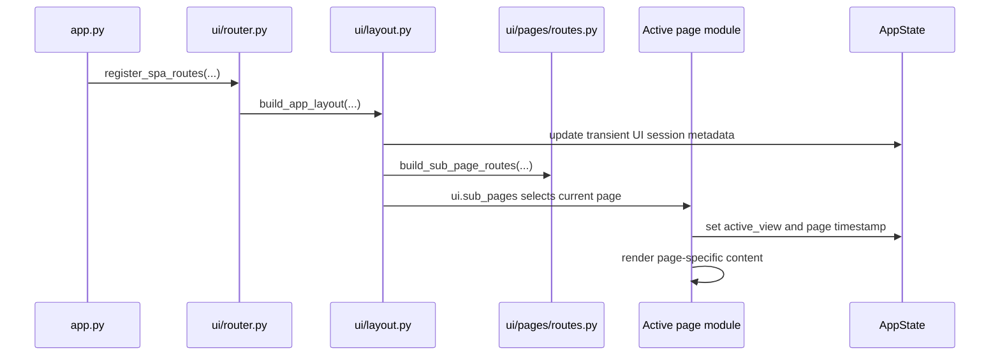

# 🖥️ UI Shell Guide

This guide explains the reusable application shell introduced in version `0.8.0`.

Use it when you need to add pages, extend navigation, adjust visual identity, or understand how the NiceGUI UI is separated from application startup, settings, logging, and infrastructure code.

---

## 🎯 Goals

The UI shell exists to make the template immediately useful for new desktop applications without adding domain-specific business logic.

It provides:

- a shared top application bar;
- a reusable navigation sidebar;
- a central SPA content area powered by `ui.sub_pages`;
- a domain-neutral component catalog;
- runtime diagnostics rendered from application-level snapshots;
- a bounded log viewer backed by a reusable log reader service;
- a status page for current and recent in-memory feedback;
- a settings page backed by validated preference services;
- centralized visual classes for light and dark theme support.

The shell is intentionally simple. It should remain a foundation, not a framework inside the project.

---

## 🧭 Built-in routes

| Route          | Module                                         | Purpose                                                                    |
| -------------- | ---------------------------------------------- | -------------------------------------------------------------------------- |
| `/`            | `src/desktop_app/ui/pages/index.py`            | Landing page with startup status and template capabilities.                |
| `/components`  | `src/desktop_app/ui/pages/components.py`       | Live catalog for reusable cards, badges, page headers, and empty states.   |
| `/diagnostics` | `src/desktop_app/ui/pages/diagnostics.py`      | Runtime diagnostics from application snapshots.                            |
| `/logs`        | `src/desktop_app/ui/pages/logs.py`             | Bounded viewer for recent runtime log lines.                               |
| `/status`      | `src/desktop_app/ui/pages/status.py`           | Current status and recent in-memory status history.                        |
| `/settings`    | `src/desktop_app/ui/pages/settings.py`         | Validated preferences saved through application services.                  |
| fallback       | `src/desktop_app/ui/pages/not_found.py`        | Recovery page for unknown SPA routes.                                      |

The route table is centralized in [`src/desktop_app/ui/pages/routes.py`](../src/desktop_app/ui/pages/routes.py).

---

## 🏗️ Structure

```text
src/desktop_app/ui/
├── components/
│   ├── __init__.py
│   ├── cards.py
│   ├── feedback.py
│   ├── navigation.py
│   └── page.py
├── pages/
│   ├── __init__.py
│   ├── components.py
│   ├── diagnostics.py
│   ├── index.py
│   ├── logs.py
│   ├── not_found.py
│   ├── routes.py
│   ├── settings.py
│   └── status.py
├── __init__.py
├── layout.py
├── router.py
└── theme.py
```

Responsibilities:

| Area         | Responsibility                                                                                  |
| ------------ | ----------------------------------------------------------------------------------------------- |
| `router.py`  | Registers NiceGUI root and catch-all routes.                                                    |
| `layout.py`  | Builds the application shell, navigation, and `ui.sub_pages` mount point.                       |
| `theme.py`   | Stores reusable class strings and theme helper functions.                                       |
| `components` | Provides small reusable visual builders with no business logic.                                 |
| `pages`      | Builds route-specific UI and delegates non-visual work to application services.                  |

---

## 🔄 Rendering flow



The top-level application entry point does not know which UI pages exist. It only registers the SPA shell through [`src/desktop_app/ui/router.py`](../src/desktop_app/ui/router.py).

---

## 🎨 Theme helpers

Visual classes live in [`src/desktop_app/ui/theme.py`](../src/desktop_app/ui/theme.py).

The helpers accept `ThemeName` from [`src/desktop_app/core/state.py`](../src/desktop_app/core/state.py) and return Tailwind classes for:

- body background;
- shell root;
- top application bar;
- sidebar;
- page headers;
- content cards;
- navigation links;
- muted text.

This keeps page modules readable and avoids duplicating long class strings.

---

## 🧩 Component helpers

Shared component helpers live under [`src/desktop_app/ui/components`](../src/desktop_app/ui/components).

Current helpers:

| Module          | Helpers                                                        |
| --------------- | -------------------------------------------------------------- |
| `page.py`       | `build_page_header`, `build_section_header`                    |
| `cards.py`      | `build_info_card`, `build_metric_card`                         |
| `feedback.py`   | `build_status_badge`, `build_empty_state`                      |
| `navigation.py` | `NAVIGATION_ITEMS`, `NavigationItem`, `build_navigation`       |

Rules for new helpers:

- keep them visual and reusable;
- do not read files;
- do not write settings;
- do not call external integrations;
- keep labels generic unless the helper belongs to a specific page;
- pass required values explicitly.

---

## ➕ Adding a page

Recommended steps:

1. Create a new file under `src/desktop_app/ui/pages/`.
2. Set `state.ui_session.active_view` in the page builder.
3. Add a route in `src/desktop_app/ui/pages/routes.py`.
4. Add a navigation item in `src/desktop_app/ui/components/navigation.py`, when the page should be visible in the sidebar.
5. Add tests in `tests/ui/test_pages_and_router.py`.
6. Update this guide only when the page becomes part of the reusable template contract.

Example shape:

```python
from datetime import datetime

from nicegui import ui

from desktop_app.core.state import get_app_state
from desktop_app.ui.components.page import build_page_header


def build_example_page() -> None:
    """Build the example page."""
    state = get_app_state()
    state.ui_session.active_view = "example"
    state.ui_session.last_page_built_at = datetime.now()

    build_page_header(
        title="Example",
        description="Example reusable page.",
        theme=state.ui.theme,
    )
    ui.label("Page content")
```

---

## 🧪 Testing expectations

The UI test suite uses a fake NiceGUI object instead of launching a server or browser.

Current UI tests validate:

- shell mounting;
- route registration;
- page state updates;
- component catalog rendering;
- diagnostics sections;
- bounded log snapshots;
- settings controls;
- status history rendering;
- fallback page recovery link.

Run:

```powershell
pytest tests/ui/test_pages_and_router.py
```

Run the full validation before release:

```powershell
pytest
ruff check .
ruff format --check .
```

---

## ⚠️ Boundary rules

Keep these boundaries intact:

- UI pages compose NiceGUI elements.
- UI pages call `desktop_app.application` services for non-visual logic.
- Settings persistence stays in `desktop_app.infrastructure.settings`.
- Logging configuration stays in `desktop_app.infrastructure.logger`.
- Native window state stays in `desktop_app.infrastructure.native_window_state`.
- Blocking integrations must not run directly in NiceGUI callbacks.
- Domain-specific automation should be added as services and called through small UI callbacks.

This keeps the template suitable for future applications without turning the base project into a domain-specific product.

---

## 🔗 Related documents

- [Documentation index](README.md)
- [Architecture overview](architecture.md)
- [Execution modes](execution_modes.md)
- [Settings persistence](settings.md)
- [Application state](state.md)
- [Troubleshooting](troubleshooting.md)
