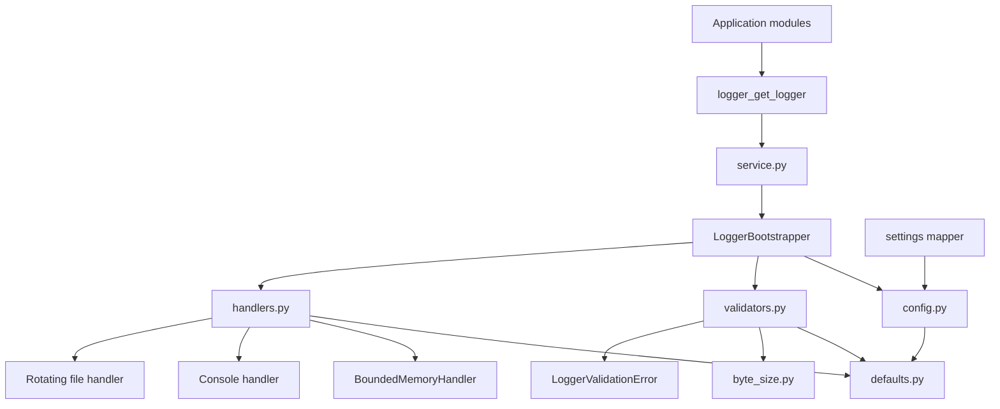
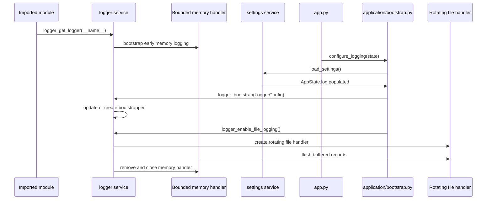

# 🖨️ Logger Package Guide

This package-local guide explains how the **NiceGui Windows Base** logger works and how maintainers should use it safely.

The logger implementation lives in:

```text
src\desktop_app\infrastructure\logger
```

Use this guide when you need to understand startup logs, add new log messages, change rotation settings, diagnose packaged execution, or maintain the logger package.

---

## 🎯 Goals

The logging subsystem is designed to:

- keep startup diagnostics available even before the final log file is ready;
- read logging settings from the application settings model;
- avoid duplicated handlers and duplicated log lines;
- write readable runtime logs in normal Python execution and packaged execution;
- rotate log files to avoid uncontrolled growth;
- release file handlers during shutdown, which is especially important on Windows;
- keep logger usage simple for application modules.

It is intentionally more structured than a direct `logging.basicConfig(...)` call because this desktop template needs reliable logs across editable execution, browser development mode, and PyInstaller one-file builds.

---

## 🧭 Public API

Application modules should import logging functions from the package API:

```python
from desktop_app.infrastructure.logger import logger_get_logger

logger = logger_get_logger(__name__)
```

The public API is declared in:

- [`__init__.py`](__init__.py)

Important public symbols:

| Symbol                            | Purpose                                                      |
| --------------------------------- | ------------------------------------------------------------ |
| `LoggerConfig`                    | Stores logger configuration values.                          |
| `LoggerBootstrapper`              | Controls handlers, buffering, file activation, and shutdown. |
| `LoggerValidationError`           | Represents invalid logger configuration values.              |
| `logger_get_logger(...)`          | Returns the application root logger or child logger.         |
| `logger_bootstrap(...)`           | Initializes or updates the global logger.                    |
| `logger_enable_file_logging(...)` | Activates rotating file logging and flushes early records.   |
| `resolve_log_file_path(...)`      | Resolves the log path for normal and packaged execution.     |
| `logger_shutdown()`               | Releases handlers during application shutdown.               |

Most application code should only need `logger_get_logger(...)`.

---

## 🏗️ Module responsibilities



| File                                 | Responsibility                                                              |
| ------------------------------------ | --------------------------------------------------------------------------- |
| [`__init__.py`](__init__.py)         | Exposes the official logger API.                                            |
| [`service.py`](service.py)           | Owns the global bootstrapper instance and helper functions.                 |
| [`bootstrapper.py`](bootstrapper.py) | Coordinates logger setup, handler lifecycle, file activation, and shutdown. |
| [`config.py`](config.py)             | Defines the `LoggerConfig` data container.                                  |
| [`defaults.py`](defaults.py)         | Stores logger-owned defaults, formats, and validation limits.               |
| [`byte_size.py`](byte_size.py)       | Parses logger rotation sizes without depending on shared infrastructure.    |
| [`validators.py`](validators.py)     | Normalizes levels, paths, buffer sizes, rotation sizes, and backup counts.  |
| [`handlers.py`](handlers.py)         | Creates console, memory, and rotating file handlers.                        |
| [`paths.py`](paths.py)               | Resolves the runtime log file path for normal and packaged execution.       |
| [`exceptions.py`](exceptions.py)     | Declares `LoggerValidationError`.                                           |

---

## 🚀 Startup flow

`app.py` delegates logging setup to `application/bootstrap.py` through `configure_logging()` before the application startup sequence continues.



Why this matters:

1. Some modules create loggers during import.
2. At that moment, the final log file path may not be known yet.
3. Early records are kept in a bounded memory handler.
4. `settings.toml` is loaded and mapped into `AppState.log`.
5. `application/bootstrap.py` resolves the runtime log path and bootstraps the final logger configuration.
6. File logging is enabled.
7. The early records are flushed into the rotating log file.

This prevents losing important startup records without allowing unbounded memory growth.

---

## ⚙️ Settings integration

Logging defaults are stored in:

```text
src\desktop_app\settings.toml
```

The supported log settings are:

```toml
[app.log]
level = "INFO"
enable_console = true
buffer_capacity = 500
file_path = "logs/app.log"
rotate_max_bytes = "5 MB"
rotate_backup_count = 3
```

`application/bootstrap.py::configure_logging()` loads settings first, then builds `LoggerConfig` from `AppState.log`.

In packaged execution, console logging is disabled even if the setting allows console output, because the executable is built with PyInstaller `--windowed`.

---

## 📁 Log file location

The default relative log file is:

```python
Path("logs") / "app.log"
```

The logger package resolves the final location through [`paths.py`](paths.py). `application/bootstrap.py` calls that resolver during `configure_logging()` and then passes the resulting path to `LoggerConfig`.

The final location is resolved as follows:

| Runtime                 | Log location                               |
| ----------------------- | ------------------------------------------ |
| Normal Python execution | `<current-working-directory>\logs\app.log` |
| Environment override    | `%DESKTOP_APP_ROOT%\logs\app.log`          |
| PyInstaller executable  | `<executable-directory>\logs\app.log`      |

The packaged executable uses a log directory next to the executable so users and maintainers can inspect runtime diagnostics without opening a console window.

Absolute log paths are preserved as provided. Relative paths are anchored to the settings runtime root.

---

## 🧱 Handler model

The logger may use three handler types during its lifecycle.

### 🧠 Bounded memory handler

`BoundedMemoryHandler` stores early log records before file logging is active.

Key behavior:

- keeps only the most recent records;
- avoids unbounded memory growth;
- flushes records to the rotating file handler when file logging starts;
- is removed after file logging is enabled.

### 💻 Console handler

The console handler is useful during normal Python execution.

In packaged execution, console logging is disabled because the executable is built with PyInstaller `--windowed` and should not open an extra terminal window.

### 📄 Rotating file handler

The file handler writes UTF-8 logs and rotates them using settings from `settings.toml`.

Default values:

```text
rotate_max_bytes = "5 MB"
rotate_backup_count = 3
```

This keeps:

- `app.log`
- `app.log.1`
- `app.log.2`
- `app.log.3`

when rotation is triggered.

---

## 📏 Log rotation size limits

`rotate_max_bytes` defines the maximum size of the active log file before rotation.

The logger accepts the value as an integer number of bytes or as a readable string handled by the validator layer, such as:

```text
5 MB
512KB
1 GB
```

Current rotation size limits:

| Setting               |   Value |           Bytes | Purpose                                                       |
| --------------------- | ------: | --------------: | ------------------------------------------------------------- |
| Minimum accepted size | `1 MiB` |     `1,048,576` | Prevents excessively frequent rotation and noisy file churn.  |
| Default size          | `5 MiB` |     `5,242,880` | Keeps logs useful while limiting disk usage for desktop runs. |
| Maximum accepted size | `1 GiB` | `1,073,741,824` | Prevents accidental creation of very large log files.         |

Recommended behavior:

- keep the default `5 MiB` for normal desktop usage;
- reduce the value only when disk space is very limited;
- increase the value only when diagnosing verbose `DEBUG` logs;
- avoid values below `1 MiB`, because they are rejected by validation.

---

## 📜 Log levels and narrative

The project separates operational narrative from technical evidence:

| Level       | Use for                                                   |
| ----------- | --------------------------------------------------------- |
| `INFO`      | Runtime milestones that explain the main execution story. |
| `DEBUG`     | Technical evidence useful during diagnosis.               |
| `WARNING`   | Recoverable problems or degraded behavior.                |
| `ERROR`     | Runtime failures that require attention.                  |
| `EXCEPTION` | Errors where traceback should be preserved.               |

Examples of `INFO` messages:

```text
Logging initialized for NiceGui Windows Base.
Starting NiceGui Windows Base startup sequence.
Startup source resolved: the packaged executable.
Runtime mode resolved: native mode with reload disabled.
Starting NiceGUI runtime in native mode on port 53124.
NiceGUI runtime started.
Application shutdown completed.
```

Examples of `DEBUG` evidence:

```text
Application working directory: ...
Python executable in use: ...
PyInstaller extraction directory marker: ...
Settings file path resolved: ...
Page image resolved for the index page: ...
Native window lifecycle handlers registered.
```

See also:

- [Execution modes](../../../../docs/execution_modes.md#-runtime-log-narrative)
- [Settings subsystem](../../../../docs/settings.md)
- [Troubleshooting](../../../../docs/troubleshooting.md)

---

## ✅ How to add log messages

Use one logger per module:

```python
from desktop_app.infrastructure.logger import logger_get_logger

logger = logger_get_logger(__name__)
```

Recommended patterns:

```python
logger.info("Starting file synchronization.")
logger.debug("Resolved source directory: %s", source_dir)
logger.warning("Remote service is unavailable; retry will be attempted later.")
logger.exception("Unexpected failure during file synchronization.")
```

Avoid:

```python
logger.info(f"Resolved source directory: {source_dir}")
```

Prefer `%s` placeholders so formatting is deferred until the record is actually emitted.

---

## 🔐 Sensitive data rules

Do not log sensitive values, such as:

- passwords;
- access tokens;
- SAP credentials;
- SharePoint secrets;
- full personal identifiers;
- confidential document contents.

When diagnosing integrations, log stable technical context instead:

```python
logger.debug("SharePoint target library resolved: %s", library_name)
logger.info("SAP export completed successfully.")
logger.warning("SAP session was not available; user action is required.")
```

For SAP GUI, RPA, and SharePoint integrations, keep logs useful for support without exposing business data.

---

## ⚙️ Configuration rules

Logger configuration uses `LoggerConfig`:

```python
LoggerConfig(
    level="INFO",
    enable_console=True,
    file_path=Path("logs") / "app.log",
    rotate_max_bytes="5 MB",
    rotate_backup_count=3,
)
```

Logger defaults live in [`defaults.py`](defaults.py), not in application-level constants. The application still owns final logger configuration through `application/bootstrap.py`, which builds `LoggerConfig` from `AppState.log`.

The logger name cannot be changed after bootstrapper creation. This prevents handler duplication and keeps child logger names stable.

---

## 🧪 Maintenance checklist

When changing the logger package, validate at least:

```powershell
python -m compileall -q src dev_run.py
pytest tests/infrastructure/logger
ruff check .
ruff format --check .
```

Then run the main execution modes:

```powershell
nicegui-windows-base
python -m desktop_app
python dev_run.py
```

For packaging behavior, run:

```powershell
.\scripts\package_windows.ps1
.\dist\nicegui-windows-base.exe
```

Confirm that:

- `logs\app.log` is created;
- startup records are not duplicated;
- logger settings are loaded from `settings.toml`;
- the packaged executable opens without an extra console window;
- shutdown releases the log file;
- `INFO` messages tell the main runtime story;
- `DEBUG` messages contain useful technical evidence.

---

## 🧯 Common issues

### Logs appear duplicated

Likely causes:

- a module added handlers directly through the standard `logging` API;
- `logging.basicConfig(...)` was introduced somewhere else;
- the global bootstrapper was bypassed;
- `reload=True` is being used outside `dev_run.py`.

Fix:

- use `logger_get_logger(__name__)`;
- keep handler creation inside `handlers.py`;
- keep global lifecycle control inside `service.py` and `bootstrapper.py`;
- keep reload limited to browser development mode.

### No log file is created

Check:

- whether `logger_enable_file_logging()` returned `False`;
- whether the target directory is writable;
- whether the packaged executable can write next to `dist\nicegui-windows-base.exe`;
- whether security software is blocking file creation;
- whether `app.log.file_path` points to an unexpected path.

### Log file is locked on Windows

Confirm that application shutdown calls:

```python
logger_shutdown()
```

This is currently wired through [lifecycle handlers](../lifecycle.py).

---

## 🔗 Related documents

- [Documentation index](../../../../docs/README.md)
- [Settings subsystem](../../../../docs/settings.md)
- [Application state](../../../../docs/state.md)
- [Execution modes](../../../../docs/execution_modes.md)
- [Windows packaging](../../../../docs/packaging_windows.md)
- [Troubleshooting](../../../../docs/troubleshooting.md)
- [Code quality with Ruff](../../../../docs/code_quality.md)
