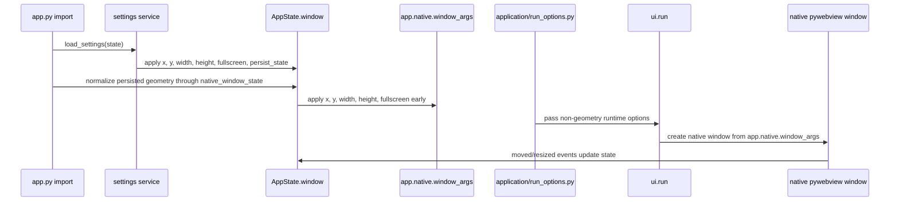
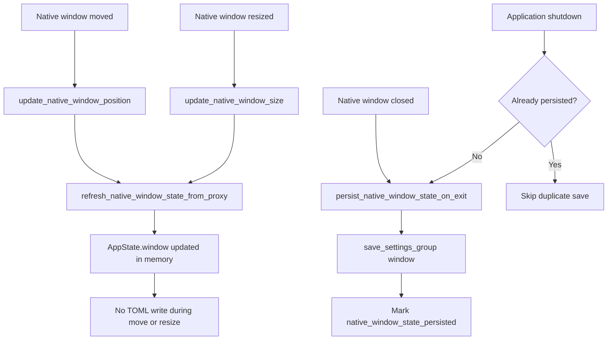

# 🪟 Native Window State Package

This package owns native desktop window geometry for **NiceGui Windows Base**.

It restores, captures, validates, and saves the native desktop window position and size while keeping startup geometry centralized in `app.native.window_args`.

Lifecycle integration lives in:

```text
src\desktop_app\infrastructure\lifecycle.py
```

Related persisted values are documented in [Settings subsystem](../../../../docs/settings.md) and the in-memory model is documented in [Application state](../../../../docs/state.md).

---

## 🎯 Goals

Native window persistence is designed to:

- restore the last native window size and position when the application starts;
- keep callbacks in `lifecycle.py` small and delegate geometry logic to infrastructure code;
- update `AppState.window` from real native move and resize events;
- save only the `window` settings group when the native window closes or the application shuts down;
- avoid writing the settings file on every native move or resize event;
- prevent monitor changes from leaving the application outside the visible desktop;
- support multi-monitor Windows setups, including monitors with negative virtual-screen coordinates.

---

## 🧱 Module map

| Module           | Responsibility                                            |
| ---------------- | --------------------------------------------------------- |
| `arguments.py`   | Synchronizes `app.native.window_args` before startup.     |
| `assignment.py`  | Provides small mutation helpers.                          |
| `bridge.py`      | Isolates direct NiceGUI `app.native` access.              |
| `defaults.py`    | Stores package-local geometry limits and attribute names. |
| `events.py`      | Reads native event payloads and updates in-memory state.  |
| `geometry.py`    | Handles monitor detection and coordinate normalization.   |
| `models.py`      | Defines `MonitorWorkArea`.                                |
| `persistence.py` | Persists the settings `window` group.                     |
| `service.py`     | Coordinates startup-time normalization.                   |

## ✅ Design notes

- Application modules should import from `desktop_app.infrastructure.native_window_state`, not from submodules.
- Direct `ui.run(...)` window geometry options are intentionally avoided.
- Event helpers update memory only; persistence is centralized in `persistence.py`.
- Monitor correction changes coordinates only and does not resize the saved window.
- The package still depends on application `AppState`, NiceGUI native access, and the settings service, so it is application-specific rather than fully reusable.

---

## ⚙️ User setting

Window persistence is controlled by:

```toml
[app.window]
persist_state = true
```

When the value is `true`, the application restores and saves geometry.

When the value is `false`, the application resets persisted geometry to the defaults from `WindowState` and saves the `window` group. This prevents stale coordinates from being reused when persistence is enabled again later.

---

## 🧭 Startup flow

The application applies native window geometry before `main()` starts.



Important detail: `x`, `y`, `width`, `height`, and `fullscreen` are applied through `app.native.window_args` before `ui.run(...)` creates the native window. The application intentionally does not pass window geometry through `ui.run(...)`; this keeps one startup source of truth for the native backend.

---

## 🖥️ Multi-monitor safety

Persisted coordinates can become unsafe when monitors are disconnected, reordered, moved in Windows display settings, or replaced by monitors with different resolutions.

The application handles this by using Windows monitor work areas:

1. enumerate monitors through Win32 `EnumDisplayMonitors`;
2. read each monitor `rcWork` through `GetMonitorInfoW`;
3. select the monitor that most overlaps the persisted window;
4. if the persisted window is outside every monitor, select the nearest monitor;
5. adjust only `x` and `y` when the saved position would make the window hard to recover.

The guard rails are applied per axis and intentionally preserve the saved width and height. Only the starting coordinate is adjusted:

| Situation                                                                   | Rule                                                            |
| --------------------------------------------------------------------------- | --------------------------------------------------------------- |
| `x` is greater than 90% of the selected work-area width                     | Move `x` back to the 90% mark of that work area.                |
| `y` is greater than 90% of the selected work-area height                    | Move `y` back to the 90% mark of that work area.                |
| `x + width` leaves less than 10% of the work area visible on the left side  | Move `x` to the selected work-area left edge.                   |
| `y + height` leaves less than 10% of the work area visible above the screen | Move `y` to the selected work-area top edge.                    |
| width and height                                                            | Preserve the saved values during monitor visibility correction. |

For the primary monitor, the work-area left and top edges are normally `0`. In multi-monitor layouts, the same rule uses the selected monitor origin, so monitors positioned to the left or above the primary monitor can still use negative virtual-screen coordinates safely.

---

## 🔄 Runtime event flow

Native lifecycle handlers keep in-memory geometry current while the application is running. Move and resize events update `AppState.window` from the event payload and then try to refresh the complete geometry from the NiceGUI native window proxy. This matters because resizing from the left or top border can change both position and size.

The settings file is intentionally not written on each move or resize event. This avoids frequent TOML writes while the user drags the window and preserves the current working behavior where the `window` settings group is saved during close or shutdown.



This keeps runtime geometry accurate without turning high-frequency native events into repeated file writes. Shutdown still protects the final state, but it does not write the same window group again when the close handler already saved it successfully.

## 💾 Save behavior

On native move and resize events, the application:

1. updates `AppState.window` from the event payload when available;
2. refreshes the latest position and size from the native window proxy when available;
3. keeps `last_saved_at` unchanged;
4. does not write `settings.toml`.

On native window close, the application tries to refresh `AppState.window` from the latest native event or native window object before saving only the `window` settings group. Application shutdown retries that save only when the close handler did not already persist the state successfully.

The saved values are:

```toml
[app.window]
x = 100
y = 100
width = 1024
height = 720
maximized = false
fullscreen = false
monitor = 0
persist_state = true
storage_key = "nicegui_windows_base_window_state"
```

---

## 🧪 Validation commands

Run focused tests after changing this feature:

```powershell
pytest tests/infrastructure/test_native_window_state.py
pytest tests/infrastructure/test_native_window_state_package.py
pytest tests/infrastructure/test_lifecycle.py
pytest tests/infrastructure/settings/test_mapper.py
pytest tests/infrastructure/settings/test_toml_document.py
```

Run the broader safety checks before committing:

```powershell
python -m compileall -q src dev_run.py
pytest
ruff check .
ruff format --check .
```

---

## 🧯 Troubleshooting

### Window opens outside the visible area

Edit the persistent runtime file, not the bundled template:

```text
settings.toml
```

Set:

```toml
[app.window]
persist_state = false
```

Start the application once. The geometry should be reset to defaults and saved back to the file.

### Manual TOML changes are ignored

Confirm you edited the correct runtime file:

| Runtime                 | File to edit                           |
| ----------------------- | -------------------------------------- |
| Normal Python execution | `<repository-root>\settings.toml`      |
| Packaged executable     | `<executable-directory>\settings.toml` |
| Custom root             | `%DESKTOP_APP_ROOT%\settings.toml`     |

The bundled file at `src\desktop_app\settings.toml` is the default template, not the normal runtime settings file.

### Position changes are saved but not restored

Confirm native mode is active. Browser development mode does not create a native desktop window, so native geometry is not restored there.

---

## 🔗 Related documents

- [Settings subsystem](../../../../docs/settings.md)
- [Application state](../../../../docs/state.md)
- [Execution modes](../../../../docs/execution_modes.md)
- [Troubleshooting](../../../../docs/troubleshooting.md)
